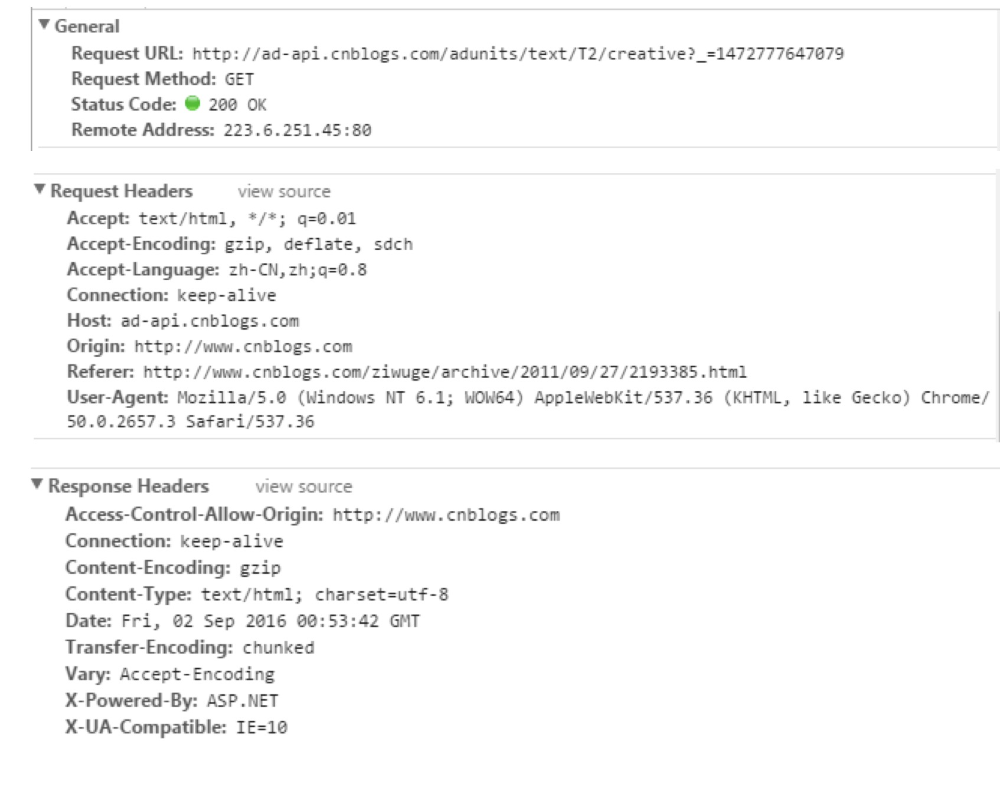

# 前端面试题

## CSS

### 经常遇到的浏览器的兼容性有哪些？原因以及解决方法是什么？常用hack技巧？

```js
png24位的图片在IE6浏览器上出现背景，解决方案是做成png8

浏览器默认的margin和padding不同。解决方案是加一个全局的
*{margin:0;padding:0;}来统一

IE6双边距bug: 块属性标签float后，又有横行的margin的情况，在ie6显示margin比设置的大
浮动IE产生的双倍距离
box{ float:left; width:10px; margin:0 0 0 10px;}
这种情况之下IE会产生20px的距离，解决方案是在float的标签样式控制中加入 ——
display:inline;将其转化为行内属性。(这个符号只有ie6会识别)

渐进识别，利用`\9`标记将IE浏览器分离出来
然后，再使用'+'将IE8和IE7，IE6分离开

.bb{
    background-color:red;/*所有识别*/
    background-color:#00deff\9; /*IE6、7、8识别*/
    +background-color:#a200ff;/*IE6、7识别*/
    _background-color:#1e0bd1;/*IE6识别*/
}

IE下，可以获取常规属性的方法来获取自定义属性
也可以使用getAttribute()获取自定义属性
Firefox下，只能使用getAttribute()获取自定义属性。
解决：统一使用getAttribute()

IE下，event对象有x,y属性，但是没有pageX,pageY属性
Firefox下，有pageX,pageY，但没有x,y

Chrome中文界面默认会将小于12px的文本强制按照12px显示
可以css中加入
-webkit-text-size-adjust: none; 解决。

超链接访问过后hover属性不见了，被点击访问的超链接样式不再具有hover和active了解决方法是改变CSS属性的排列顺序
L-V-H-A :  a:link {} a:visited {} a:hover {} a:active {}
```


### 为什么要初始化CSS样式

```js
浏览器兼容问题，不同浏览器对有些标签的默认值不同，如果没对CSS初始化，往往会出现浏览器之家的页面显示差异

最简单的初始化（非常不建议）
* {padding: 0; margin: 0;}

或者采用淘宝的样式初始化
body, h1, h2, h3, h4, h5, h6, hr, p, blockquote, dl, dt, dd, ul, ol, li, pre, form, fieldset, legend, button, input, textarea, th, td { margin:0; padding:0; }
  body, button, input, select, textarea { font:12px/1.5tahoma, arial, \5b8b\4f53; }
  h1, h2, h3, h4, h5, h6{ font-size:100%; }
  address, cite, dfn, em, var { font-style:normal; }
  code, kbd, pre, samp { font-family:couriernew, courier, monospace; }
  small{ font-size:12px; }
  ul, ol { list-style:none; }
  a { text-decoration:none; }
  a:hover { text-decoration:underline; }
  sup { vertical-align:text-top; }
  sub{ vertical-align:text-bottom; }
  legend { color:#000; }
  fieldset, img { border:0; }
  button, input, select, textarea { font-size:100%; }
  table { border-collapse:collapse; border-spacing:0; }
```


### 使用css预处理器吗？喜欢哪个？

```js
SASS, LESS, Stylus等，原理都是最终会编译打包成正式css运行

主要的方便之处是：

- 支持变量，便于复用，特别是多套皮肤时

- 支持嵌套，复杂的父子级关系时更为清晰
```

### css优化，提升性能的方法

```js
过滤掉无关规则（这样系统不会浪费时间去匹配它们）

减少层级（层级过多会影响效率）

提取项目共有样式，增加复用性（可维护）

使用预处理器或构建工具（如gulp对css进行语法检查，自动补全前缀，打包压缩，自动优雅降级等）
```

### 在网页中应该使用奇数还是偶数字体？为什么？

```js
偶数字体

1.（重要）偶数字号相对更容易和web设计的其他部分构成比例关系（譬如16 * 0.5 = 8）

2.一些字体点阵（点阵字体也叫位图字体）只提供偶数字体（如早期windows自带中易宋体-新宋体等），而奇数13时用的是小一号的点阵（每个字的占据空间大了1px，但点阵没变）
据说早起的windows字体点阵中，有2，14，15，16，唯独少13

3.后续偶数更多的是一种习惯

另外，12显示英文很好，但是中文太小，14对中英文都太大，13比较合适（譬如知乎是13）
```

### margin和padding分别适用什么场景使用？

```js
margin隔开元素与元素直接的间距（用于布局分开元素，使得元素直接互不相关）
padding隔开元素与内容的间距（让内容与包裹之间有一段空）
```

### 抽离样式模块怎么写，说出思路。

```js
这种说法应该指的是：css的初始化，消除不同浏览器下标签的样式差异

一般采用的是一段经典的cssreset写法

包括  body,h1,h2...等标签的margin和padding置0
一些标签的通用字体设置
table的边框同设等
```

### 元素竖向的百分比设定是相对于容器的高度吗？

```js
元素的竖向百分比设定是基于容器的宽度而不是高度

可以自行测试一旦修改容器宽度，发现竖向百分比对于的值也增加了
http://www.webhek.com/post/vertical-percentages-are-relative-to-container-width-not-height.html
```

### 全屏滚动的原理是什么？用到了css的哪些属性？

```js
多个页面，每一个页面分别占据页面的100%高度，每次切换页面时全屏滚动

它的原理和图片轮播一样，都是基于css的transform属性
每一个页面初始化时的y值不同(间隔一个屏幕高度)
然后页面切换时，切换到不同的y值

一般会使用transform,transition等属性，分别用来设置坐标，设置过渡时间等
有时候还可以用其它过渡效果，如透明度，颜色渐变等
```

### 什么是响应式设计？响应式设计的原理是什么？如何兼容低版本的IE

```html
响应式布局是Ethan Marcotte在2010年5月份提出的一个概念

页面根据不同的设备环境进行相应调整，譬如兼容手机和pad(一个页面多个终端，而不是每一个终端一个特定版本)

核心原理是使用css media query，通过媒体查询去检测不同设备的尺寸
@media 设备名 only （选取条件） not （选取条件） and（设备选取条件），设备二{rules}
可以在link中加上media媒体查询属性决定是否加载
也可直接在样式中用@media

页面头部必须加上声明viewport
name="viewport" content="width=device-width, initial-scale=1, maximum-scale=1, user-scalable=no”

兼容ie可以使用js来判断并兼容（ie不支持媒体查询）
ie肯定只是pc端展示，因此更多的是pc端兼容问题，而不是不同设备的响应式

优点:
1.  面对不同的分辨率设备灵活性强
2.  能够快捷解决多设备显示适应问题
缺点:
1.  需要兼容各种设备，工作量大，效率低下
2.  代码累赘，会出现隐藏无用元素，加载时间长
3.  一定程度上改变了网站的原有布局结构，会出现用户混淆的情况
4.  这是一种折中性质的解决方案，有时候会因为多方面因素，而达不到最佳效果

```

### viewport的理解？

```js
layout viewport（布局视口）
移动设备浏览器一般都会默认设置一个viewport标签
它的作用是定义一个虚拟的layout viewport，用于解决早起的页面在手机显示问题

譬如默认情况下iOS,android中将这个视口分辨率设置为980px
所以，pc端网页基本能在手机上展示，只不过元素看起来很小（默认可以通过手指缩放）

当然也可以自己设定一个宽-一般会取device-width

visual viewport（视觉视口）和物理像素
visual viewport（视觉视口）为物理屏幕的可视区域
屏幕显示器的物理像素，同样尺寸的屏幕，像素密度大的设备，硬件像素会更多
例如iPhone的物理像素：
    iPhone5 ：640 * 1136
    iPhone6：750 * 1334
    iPhone6 Plus：1242 * 2208

ideal viewport（理想视口）和 dip （设备逻辑像素）
ideal viewport（理想视口）通常是我们说的屏幕分辨率。
dip （设备逻辑像素）跟设备的硬件像素无关的。一个 dip 在任意像素密度的设备屏幕上都占据相同的空间。

比如MacBook Pro的 Retina （视网膜）屏显示器硬件像素是：2880 * 1800。
当你设置屏幕分辨率为 1920 * 1200 的时候，ideal viewport（理想视口）的宽度值是1920像素，
那么 dip 的宽度值就是1920。设备像素比是1.5（2880/1920）。
设备的逻辑像素宽度和物理像素宽度（像素分辨率）的关系满足如下公式：
    逻辑像素宽度*倍率 = 物理像素宽度

而移动端手机屏幕通常不可以设置分辨率，一般都是设备厂家默认设置的固定值
，换句话说 dip 的值就是 ideal viewport（理想视口）（也就是分辨率）的值
譬如，iPhone的屏幕分辨率：
    iPhone5 ：分辨率 320 * 568，物理像素 640 * 1136，@2x
    iPhone6：分辨率 375 * 667，物理像素 750 * 1334，@2x
    iPhone6 Plus ：分辨率 414 *  736，物理像素1242 * 2208，@3x，（
    注意，实际显示图像等比降低至1080×1920，具体原因查看：http://www.css88.com/archives/5972）
    
更多设备的 ideal viewport（理想视口）可以查看http://viewportsizes.com/

css像素
CSS像素（px）用于页面布局的单位。样式的像素尺寸（例如 width: 100px）是以CSS像素为单位指定的。
CSS像素与 dip 的比例即为网页的缩放比例，如果网页没有缩放，那么一个CSS像素就对应一个 dip（设备逻辑像素）    
（譬如为device-width时，css像素与逻辑像素一样）

使用viewport元标签控制布局
```

```html
<meta name="viewport" content="width=device-width; initial-scale=1.0; maximum-scale=1; user-scalable=no;">
```

```js
width属性被用来控制layout viewport（布局视口）的宽度，layout viewport（布局视口）宽度默认值是设备厂家指定的。
iOS, Android基本都将这个视口分辨率设置为 980px。
我们可以 width=320 这样设为确切的像素数，也可以设为device-width这一特殊值
一般为了自适应布局，普遍的做法是将width设置为device-width

width=device-width 也就是将layout viewport（布局视口）的宽度设置 ideal viewport（理想视口）的宽度。
网页缩放比例为100%时，一个CSS像素就对应一个 dip（设备逻辑像素）
，而layout viewport（布局视口）的宽度，ideal viewport（理想视口）的宽度（通常说的分辨率），
dip 的宽度值是相等的。

height与width类似，但实际上却不常用。

initial-scale用于指定页面的初始缩放比例：
initial-scale=1 表示将layout viewport（布局视口）的宽度设置为 ideal viewport（理想视口）的宽度，
initial-scale=1.5 表示将layout viewport（布局视口）的宽度设置为 ideal viewport（理想视口）的宽度的1.5倍。

maximum-scale用于指定用户能够放大的最大比例，例如

minimum-scale是用来指定页面缩小比例的。通常情况下，不会定义该属性的值，页面太小将难以阅读。

user-scalable来控制用户是否可以通过手势对页面进行缩放。该属性的默认值为yes，可被缩放，你也可以将该值设置为no，表示不允许用户缩放网页。

http://www.css88.com/archives/5975
```

### meta viewport minimum-scale无效？

```html
<meta name="viewport" content="width=device-width, minimum-scale=0.5, initial-scale=1.0, maximum-scale=3.0">
```

```js
这样声明时会发现页面只能放大不能缩小
https://www.2cto.com/kf/201607/528515.html

可能与兼容性有关，譬如有一种说法是：
Android WebKit内核和IE浏览器的layout viewport永不会小于320px。
```

### 视差滚动效果，如何给每页做不同动画？（回到顶部，向下滑动要再次出现，和只出现一次分别怎么做？）

```js
视差滚动：多层背景以不同速度移动，形成立体的运动效果，带来出色的视觉体验

一般会有背景层，内容层，贴图（悬浮）层，滚动时，不同速度移动

一般原理是：各个页面是fixed布局，然后监听滚动（譬如滚轮），
在滚动的不同距离以此移动对于图层的top值
```

### ::before和:after中双冒号和单冒号有什么区别？解释下这两个伪元素的作用？

```js
双冒号是css3规范中引入的
正常来说，单冒号用于伪类，双冒号用于伪元素
不过浏览器会支持单冒号表示伪元素的写法

伪元素譬如：(代表会新增东西)
::first-letter-将特殊的样式添加到文本的首字母
::first-line-将特殊的样式添加到文本的首行
::before-在某元素之前插入某些内容
::after-在某元素之后插入某些内容

伪类譬如：(代表特定状态)
active-将样式添加到被激活的元素
:focus-将样式添加到被选中的元素
:hover-当鼠标悬浮在元素上方时，向原生添加样式
:link-将特殊的样式添加到未被访问的链接
:visited-将特殊样式添加到被访问过的链接
:first-child-将特殊的样式添加到元素的第一个元素
:lang-运行创作者来定义指定元素中使用的语言
```

```js
伪类用于向某些选择器添加特殊效果（：表示），可以认为只是改变某个状态
伪元素用于将特殊效果添加到某些选择器（：：表示），可以认为新元素生成（dom树中找不到）
有时候为了一些就浏览器兼容，伪元素也用（：）表示，比如兼容ie

区别：
伪类的效果可以通过添加一个实际的类达到，
而伪元素的模拟则需要添加一个实际的元素才能达到

伪类理解为状态（比如:first-child相当于给第一个元素添加样式，并不需要添加元素），
而伪元素可以理解为伪造的元素（譬如：：after表示插入一个新的元素）

在不考虑兼容的情况下，伪类用（：表示），伪元素用（：：）表示
```

### position属性的三个值：relative，absolute，fixed的区别？

```js
relative:
生成相对元素，无top,left时，元素就是在正常的文档流中，
譬如如果设置了left:20px，就会从左侧偏离20像素

absolute:
生成绝对定位元素，相对于上级元素中第一个position属性非static的元素来定位
使用left,right,top,bottom来定位

fixed:
生成绝对定位元素，相对于浏览器视窗来定位
使用left,right,top,bottom定位

position的其它值:
static:默认值，没有定位，元素出现在正常流中
忽略top,bottom,left,right或者z-index声明

```

### 如何修改chrome记住密码后自动填充表单的黄色背景？

```js
input:-webkit-autofill, textarea:-webkit-autofill, select:-webkit-autofill {
    background-color: rgb(250, 255, 189); /* #FAFFBD; */
    background-image: none;
    color: rgb(0, 0, 0);
}
  
主要是 -webkit-autofill 样式
```

### 对line-height是如何理解的？

```js
指定了一行字的高度，定义是同一个元素中（比如同一个p）两个文本行基线之间的距离
如果div没有高度，但是里面有文字，那么它会被文字的line-height默认撑开

line-height只影响行内元素，并不能直接应用与块级元素
具有可继承性，块级元素的子元素会继承该特性，并在行内元素上生效


譬如，简单的把height设置和行高一样的话，可以实现单行文本居中
```

### 设置元素浮动后，该元素的display值是什么?

```js
浮动后的display值自动变为了display:block
```

### 怎么让chrome支持小于12px的文字？

```js
使用小于12px的字体，非chrome可以不考虑兼容，chrome中加上
-webkit-text-size-adjust: none
有一个后果，就是如果放大了网页，字体不会随着一起放大（所以不建议全局使用，而是特定需要兼容的使用）

其他障眼法
如用图片替代文字
```

### 让页面里的字体变清晰，用css怎么做？

```js
-webkit-font-smoothing: antialiased
加上抗锯齿渲染（非标准）

另外有人总结过只在macOS 的webkit中有效
https://segmentfault.com/q/1010000000467910
```

### font-style属性可以让它赋值为"oblique"，什么意思？

```js
倾斜的字体样式

和italic的区别：
italic是斜体
oblique是倾斜的文字排版（模仿的斜体，但不是斜体）
```

### display:inline-block什么时候会显示间隙？

```js
换行或空格会占据一定的位置，从而产生间隙

解决方法：
去除空格
使用margin负值
使用font-size：0（本质也是去除了空格的占位）
letter-spacing,word-spacing
譬如letter-spaceing:-4px
```

### position:fixed在手机上无效怎么处理？

```js
fixed是基于整个页面固定，而某些场景下滑动的是整个viewport,
网页并没有滑动，所以fixed看起来跟没有固定一样(实际上它并没有动，只是不是相对手机屏幕的固定而已)

一般是没有加viewport声明的缘故，加上即可
meta name="viewport" content="width=device-width, initial-scale=1.0, maximum-scale=1.0, minimum-scale=1.0, user-scalable=no"

另外，iOS下自带的回弹也可能造成问题
或者iOS下fixed被输入框弹出(原理是body被滚动，改成absolute，或者监听focus时临时改)

还有人的做法是使得fixed布局的父元素(body)不出现滚动，将滚动内容移到其他div内部
这样弹出后，页面本身不会滚动，不会有这个问题

还有一种是页面上同时添加了滑动事件，如：overflow：auto/scroll等，就会出现这样的BUG：
当滑动页面时，input框（fixed）就会掉下来，fixed属性失效。
解决是使用iscroll等插件（不使用overflow：auto/scroll，iScroll内部是自己用的translate动画-低版本也是js模拟动态修改top）
```

### 如果需要手写动画，你认为最小间隔是多久，为什么？

```js
很多显示器的频率仍然是： 60HZ，所以理论上是
1/60*1000ms = 16.7ms
```

### overflow:scroll不能平滑滚动的问题

```js
特别是iOS下

1.需要-webkit-overflow-scrolling： touch开启硬件加速
(底层用了一个原生控件来显示的)

2.或者类似于iScroll一样，自己内部用translate动画模拟
```

### 有一个高度自适应的div，里面有两个div，一个高度100px,希望另一个填满剩下的高度

```js
1.box-sizing方案
外层box-sizing:border-box;同时设置padding:100px 0 0
内层100像素高的元素向上移动100像素，或者使用absolute布局防止占据空间
另一个元素直接height:100%

2.absolute布局
外层position:relative
百分百自适应元素直接position: absolute; top: 100px; bottom: 0; left: 0s

3.或者纯js解法
```

### png、jpg、gif这些图片格式解释一下，分别什么时候用。有没有了解过webp？

```js
GIF：
Graphics Interchange format（图形交换格式）
是一种索引颜色格式，在颜色数很少时，产生的文件极小
优点：
1.支持背景透明
2.支持动画
3.支持图形渐进
4.支持无损压缩
5.水平扫描
最大的缺点是最多只有256中颜色

jpeg：
Joint Photograhic Experts Group（联合图像专家组）
优点：
1.支持上百万中颜色
2.使用更有效的有损压缩，文件体积更小
3.更适合与照片
缺点是会损失一些细节（如艺术线条），而且有损压缩不可逆，另外就是不支持图形渐进和背景透明

png:
(Portable Network Graphic Format，PNG)流式网络图形格式
目的是企图替代GIF和tiff格式
优点：
1.存储灰度图像时，深度可多达16位
2.存储彩色图像时，深度多达48位
3.还可存储16位的透明通道
4.从LZ77派生的无损数据压缩算法。
缺点是体积相对jpg较大，对于普通图片来说，保留了过多的无用细节

一般色彩较少的纯色背景小图标等可用gif
有透明度要求的色彩丰富的可用png
其他用jpg(特别适合与普通的图片-要求不高的)

webp:（同时支持有损和无损）
google开发的一种旨在加快图片加载速度的图片格式

当有损压缩，相比较与jpg，编码同样质量的webp文件需占用更多的计算资源（体积更小，比jpg小40%）

它具有更优的图像数据压缩算法，能带来更小的图片体积，而且拥有肉眼识别无差异的图像质量；
同时具备了无损和有损的压缩模式、Alpha 透明以及动画的特性，
在 JPEG 和 PNG 上的转化效果都相当优秀、稳定和统一。

chrome中基本都支持webp

ios中还需第三方插件转换
```

### 什么是cookie隔离？（或者说：请求资源时不要让它带cookie，怎么做）

```js
如果静态文件都放在主域名下，那么静态文件请求的时候都带有的cookie的数据提交给server
浪费流量，不如隔离开

如何隔离：
因为cookie有跨域限制，因此跨域请求时默认不会带上cookie(当然可以手动强行打开的)
这样降低请求头部大小，减少请求时间

同时由于不会将cookie提交给server，也会减少server的解析环节，提高http解析速度
```

### style标签写在body后和body前有什么区别?

```js
HTML标准一直是规定style不应该出现在body中

但网页也有容错：
如果style出现在body中(或者body后更是)，效果仍然和style中一样，
但是可能会引起fouc(Flash of Unstyled Content-无内容闪烁)，重绘或重新布局
```

### 什么是FOUC？如何避免？

```js
Flash Of Unstyled Cotent
大概就是样式加载前浏览器用默认样式渲染文档，
样式加载后重新渲染文档，造成页面闪烁

解决方案是：
样式放在head中，这样在加载文档前样式已经有了
```

### 什么是CSS预处理器／后处理器？

```js
-预处理器，如less,sass,stylus
用来预编译，一般里面会有支持变量、继承等，增加了复用性
而且还会有函数，循环，mixn，层级，很方便进行组件化开发，提高工作效率

-后处理器，如postcss
譬如用来补全不同浏览器下的兼容后缀，如-webkit等
这样可以基于css规范来编写，无法写的时候关注兼容问题，更有效率,也不易出错，而且源码会更少
```

## JS


### Javascript创建对象的几种方式？

1. 隐式创建

```js
var obj = {};
```

2. new

```js
var obj = new Object();

// 或者一个构造函数

new XXX();
```

3.工厂等产生

```js
var obj = xxx();
```

### Javascript作用链域?

```js
全局函数无法查看局部函数的内部细节
局部函数可以查看上层的函数细节，直至全局细节

当需要从局部函数查找某一属性或方法时，
如果当前作用域没有找到，就会上溯到上层作用域查找
直至全局函数- 作用域链
```

http://www.cnblogs.com/lhb25/archive/2011/09/06/javascript-scope-chain.html

### 谈谈This对象的理解。

```js
this总指向函数的直接调用者(而非间接调用者)
譬如 
var ajax = Util.ajax();
ajax();
此时this指向window，而不是util


如果有new关键字，this指向new出来的那个对象

在事件中，this指向触发这个事件的对象
特殊（ie中的attachevent的this总是指向全局对象window）
```

### eval是做什么的？

```js
作用是把对应的字符串解析成js代码并运行

尽量避免使用eval，不安全而且耗性能

一次解析成js语句，一次执行

在以前，常有人用
var obj =eval('('+ str +')');

来将json字符串解析成json，但是h5中可以用JSON.stringify
```

### 什么是window对象? 什么是document对象?

```js
window对象指浏览器打开的窗口
document是当前窗口中Document对象的一个只读引用（属于window对象的一个属性）
```

### null，undefined 的区别？

```js
null表示一个“为空”的值
undefined表示一个变量声明了但是没有初始化（缺省值）

typeof null 为 object
typeof undefined 为 undefined

原型链的尽头是null

null == undefined // true
null === undefined // false

null转数字时为0
undefined转数字时为NAN

JS最初只有一个null表示无，根据c语言传统，可以自动转为0
但是js设计者觉得这样还不够

- null在java中被当初一个对象，但是js中分为原始型和合成类型，作者觉得无的值最好不是对象

- 最初js中没有错误处理机制，发生数据类型不匹配时，往往会自动转换类型或失败，但是如果null自动转成0时，不容易找出这个错误

因此又设计了一个undefined
```


### 什么是闭包(closure)，为什么要用它？

```js
闭包是指有权访问另一个函数作用域中的变量的函数

创建闭包的最常用方式：在一个函数内创建另一个函数，通过另一个函数访问这个函数的局部变量
利用闭包可以突破作用域链，将函数内部的变量和方法传递到外部
不过也经常会容易造成内存泄漏问题（无法自动回收）

特性：
1.函数内再嵌套函数
2.内部函数引用外层的参数和变量
3.参数和变量不会被垃圾回收机制回收

譬如

function sayHello() {
    // 函数内部变量
    var word = 'hello,world!';
    var index = 0;
    
    return function() {
        console.log(word + (index++));  
    };
}

var say = sayHello();

say(); // hello,world!0
say(); // hello,world!1
```

### javascript中的`"user strict";`是什么意思？使用它区别是什么？

```js
use strict是ECMAscript 5中的严格允许模式，这种模式下js在严格条件下运行

严格模式中消除了一些语法的不合法不合理处，减少了一些怪异行为
譬如不能用with,不能给未声明的全局变量赋值，不能callee，不允许直接操作argument等

严格模式消除了一些不合理不安全之处，使得代码相对更合理，而且还可以提供编译器效率，增加运行速度

最重要的是，为未来的js标准化做铺垫，未来可以认为是全部基于严格模式的（譬如es6）
```

```js
如严格模式是ECMAScript 5 中的一种模式，ECMAScript 5中有两种模式，一种是正常模式，一种是“严格模式(strict mode)”，
使用这种模式使得Javascript在更严格的条件下运行。

设立“严格模式”的目的主要有:
1.  消除JS语法的不合理，不严谨之处，减少一些怪异行为
2.  消除代码运行的不安全之处，保证代码运行的安全
3.  提高编译器效率，增加运行速度
4.  为新版本做铺垫，如ES6中全面使用了严格模式

注意，在正常模式下可以运行的代码很有可能严格模式下运行出错。而且ES6中只允许严格模式的用法。

严格模式有两种用法:
1. 在脚本文件(或<script>脚本片段)的第一行，使用“use strict”; 可以将整个脚本文件(片段)以严格模式运行
(注意，如果前面是一些不产生实际运行结果的语句，可以不再第一行-如在开头注释后面,
注意,前面有;号也会取消严格模式；但是如果前面的语句有效-如输出语句，这样则严格模式无效，整个片段会以正常模式运行)

2. 在函数体的第一行使用”use strict”;则整个函数以严格模式运行
(这种是最常用的写法，通常会将这句话放在一个立即执行的匿名函数中)
```

使用严格模式后，JS语法和行为与正常模式有所区别:

```js
1. 全局变量显示声明(正常模式下，如果一个变量没有声明就赋值，默认是全局变量，而在严格模式下，会报错)

2. 静止使用with语句(with语句主要用于设置代码在特定对象中的作用域，严格模式下禁用with语句)

3. 创设eval作用域，ES5中，正常模式下，JS语言中有两种变量作用域:全局作用域和函数作用域。
严格模式创设了第三种作用域:eval作用域(这样,eval里面不能再生成全局变量了-正常模式中eval会生影响外部作用域)。

4. 禁止this关键字指向全局对象。在正常情况下,一个普通函数内部的this会指向一个全局对象window,但是严格模式下禁止了这种用法，
严格模式下,普通函数内部的this为undefind，注意：通过new 出来的对象除外，new 出来的会指向自身

5.禁止在函数内部遍历调用栈。正常情况下函数内部可以通过caller等方法调用自身,但是严格模式下禁止了这种用法

6. 禁止删除变量（严格模式下无法删除var显示声明的变量，只能删除属性）
注意, [object Object]的属性只有configurable设置为true才能被删除，否则无法删除

7. 显式报错。
正常模式下，对于一个对象的只读属性进行赋值，不会报错，只会默默失败，严格模式下，会报错
严格模式下，对于一个使用getter方法读取的属性进行赋值，会报错
严格模式下，对禁止拓展的对象添加新属性（Object.preventExtensions(o)），会报错
严格模式下，删除一个不可删除的属性，或报错（如删除Object.prototype）
严格模式下，删除一个不可删除的属性，或报错
对象不能有重名的属性(正常模式下，如果对象有多个重名属性，最后赋值的那个属性会覆盖前面的值，严格模式下，这属于语法错误)
函数不能有重名参数(正常模式下，如果函数有多个重名参数，可以用argument[i]读取。严格模式下，属于语法错误)

8. 禁止八进制表示法
严格模式下，整数的第一位如果是0，表示这是八进制，比如0100等于十进制的64。但是严格模式下禁止这种写法，证书第一位为0，会报错

9. Arguments对象的限制。
不允许对arguments赋值
Arguments不再追踪参数的变化（如果形参a被改变，对应的arguments是不会改变的）
禁止使用arguments.callee。严格模式下，无法使用caller,也就是说匿名函数内部无法调用自身了

10. 函数必须声明在顶层
严格模式下只允许在全局作用域和函数作用域的顶层声明函数。
不允许在非函数的代码块内声明函数(ES6中会加入块级作用域概念)

11. 保留字。严格模式下，新增了一些保留字:
implements, interface, let, package, private, protected, public, static, yield
使用这些词作为变量或参数将会报错
另外,ES5本身也有些保留字:
class, enum, export, extends, import, super
以及各大浏览器自行增加的 const保留字。这些保留字都不能作为变量名或参数
```

### 如何判断一个对象是否属于某个类？

```js
譬如

a instanceof Date

const getClassName = (object) => Object.prototype.toString.call(object).match(/^\[object\s(.*)\]$/)[1];

getClassName('sss') === 'String'; // true
```

### new操作符具体干了什么呢？

```js
1.创建一个空对象，并且this变量引用该对象，同时继承该对象的原型
2.属性和方法被加入到this引用的对象中
2.新创建的对象由this引用，并且最后隐式返回this

var obj = {};
obj.__proto__ = Base.prototype;
Base.call(obj);
```

### Object.create()的作用？

```js
Object.create(proto[,propertiesObject])是ES5中提出的一种新对象创建方式
第一个参数是：要继承的原型，可以传null

第二个参数是：对象的属性描述符，可选
可选属性包括：
数据属性-
包含value(值),writable(是否可任意写),
enumerable(是否能用for in枚举),
configurable(是否能被删除,修改)特性(后面三个默认为false)

访问器属性-包含set/get特性


注意:当满足以下任一条件时，则会引发TypeError异常:
1. prototype参数不是对象而且不是null
2. descriptors参数中的描述符具有value或writable特性，并且具有get或set特性(value或writable与get或set不能同时存在)
3. descriptors参数中的描述符具有不为函数的get或set特性(get或set必须是函数)

关键点:可以创建一个继承某对象的对象
```

### new、new Object()和Object.create(proto,[propertiseObject]之间者的异同?

```js
相同点:
new和Object.create()都可以用来创建一个新的对象。new Object()当参数为空时也是创建一个新的对象

不同点:
本质不同,new 一般配合类的构造函数使用，new的时候，是先创建一个对象，然后将对象的__proto__属性指向该类的prototype。
(obj.__proto__ = Base.prototype)
Object.create(proto…)一般第一个参数直接传入一个对象，然后创建出来新对象就直接显示指向该对象了。
(obj.__proto__ = Base)
new Object()当传入参数为一个object时不会创建新对象，而是直接引用传递，
(obj === Base)
当参数不存在时，创建一个新的{}
(obj为{})

关键点:创建对象时 _proto_和prototype有区别
javascript使用__proto__指向对象的原型。
```

### JS中有一个函数，执行时对象查找时，永远不会去查找原型，这个函数是？

```js
hasOwnProperty

js中hasOwnProperty函数是返回一个布尔值，
指出一个对象是否具有指定名称的属性
此方法无法检查该对象的原型链中是否具有该属性
该属性必须是该对象本身的成员，不能是原型链上的

使用：
Object.hasOwnProperty.call(object, proName);
object必须是对象，proName必须，是属性名称的字符串形式

有则返回true,否则false
```

### JSON的了解？

```js
JSON(JavaScript Object Notation)是一种轻量级的数据交换方式

它是基于JavaScript的一个子集。
数据格式简单，易于读写，占用带宽小

例如
{"name": "zhangsan", "age": "18"}

JSON字符串转JSON对象
eval('(' + str + ')')
str.parseJSON
JSON.parse(str)

JSON转字符串
obj.toJSONString()
JSON.stringify(obj)
```

### JS延迟加载的方式有哪些?

```js
1.创建脚本时（或动态创建时），设置async属性（H5中的异步支持）

2.动态创建DOM(用的最多)，手动创建dom添加到页面中

3.或者XHR Injection，XHR Eval，Script In Iframe,Script defer属性,document.write(script tag)等

XHR Injection(XHR 注入)：通过XMLHttpRequest来获取javascript，然后创建一个script元素插入到DOM结构中

XHR Eval：与XHR Injection对responseText的执行方式不同，直接把responseText放在eval()函数里面执行

Script In Irame：在父窗口插入一个iframe元素，然后再iframe中执行加载JS的操作

defer属性：IE4.0就出现。defer属声明脚本中将不会有document.write和dom修改。浏览器会并行下载其他有defer属性的script。而不会阻塞页面后续处理。
注：所有的defer脚本必须保证按顺序执行的。

async属性：HTML5新属性。脚本将在下载后尽快执行，作用同defer，但是不能保证脚本按顺序执行。他们将在onload事件之前完成

对于支持HTML5的浏览器，实现JS的异步加载只需要在script元素中加上async属性，
为了兼容老版本的IE还需加上defer属性；
对于不支持HTML5的浏览器(IE可以用defer实现)，
可以采用以上几种方法实现。
原理基本上都是向DOM中写入script或者通过eval函数执行JS代码，
你可以把它放在匿名函数中执行，也可以在onload中执行，
也可以通过XHR注入实现，也可以创建一个iframe元素，然后在iframe中执行插入JS代码。
```

### Ajax是什么，如何创建一个Ajax?

```js
全称： Asynchronous JavaScript And XML
异步传输 + js + xml
也就是向服务器发送请求时，不必等待结果，而是可以同时做其他事情
等到有结果了它会自己根据设定进行后续操作
于此同时，页面不会整体刷新，提高了用户体验

创建：
1.创建一个XMLHttpRequest对象，也就是创建一个异步调用对象
2.创建一个新的Http请求，并指定该HTTP请求的方法，url以及验证信息
3.设置响应HTTP请求状态变化的函数
4.发送HTTP请求
5.获取异步调用返回的数据
6.使用js和dom实现局部刷新
```

### Ajax如何解决浏览器缓存问题？

```js
ajax请求中，只有get请求会有缓存

解决方案

1.ajax请求前加上:ajaxObj.setRequestHeader('If-Modified-Since', '0');
2.ajax请求前加上:ajaxObj.setRequestHeader('Cache-Control', 'no-cache');
3.在URL后面加上一个随机数: "random=" + Math.random();
4.同理在url后面加上时间戳: "nowtime=" + (new Date()).getTime();
5.jq中，可以: $.ajaxSetup({cache: false});
```

### 同步和异步的区别？

```js
同步->顺序执行

譬如 a -> b -> c

异步，回调执行

譬如

一轮循环  a -> c

循环结束后 b触发回调
```

### 连等号赋值顺序

```js
var a = {n: 1}
var b = a;
a.x = a = {n: 2}
console.log(a); // {n: 2}
console.log(a.x); // undefined
console.log(b); // {n: 1, x: {n: 2}}
console.log(b.x) // {n: 2}

因为连等号这个语句中会先确定所有遍历的指针，然后才会去对于赋值

其中
a.x = a = {n: 2} 
指针确定如下
a.x的指针已经确定了，指向了原始a的（因为原始a没有x，因此创建了一个指向null的指针）
a指向也是原始a

赋值如下
a重新指向到了新的地址 {n: 2}（栈中的指针指向了堆中新的对象）
原始a.x的指向到了 {n: 2}

因此最后
a指向到了新的{n: 2}
a.x为undefined

b指向原始a
b.x = {n: 2}
```

### 页面编码和被请求的资源编码如果不一致如何处理？

```js
譬如，如果html页面是gbk的，js是utf8的，引入js时需要加上charset='utf-8'
反之亦然
```

### 如何解决跨域问题？

```js
这个范围很大，包括js跨域，ifram跨域，ajax跨域等

如ajax跨域一般是用jsonp(old)或者(cors)方案-需要后台进行配合配置

或者用websocket等请求来进行数据交互

另外window.postMessage也可跨域跨窗口传递消息
```

### 立即执行函数，不暴露私有成员

```js
var module1 = (function() {
    var count = 1;
    
    function change() {
        count++;
    }
    
    return {
        change: change,
    };
)();
```

### AMD(Modules/Asynchronous-Definition)、CMD(Common-Module-Definition)规范的区别?

```js
AMD:
异步模块定义，所有模块异步加载，模块加载不影响后续运行，所以依赖模块的语句必须写在回调函数中
提前执行
依赖前置
主要应用于require.js
一个当多个用
cmd：
同步加载
延迟执行
依赖就近
as lazy as possible
主要应用于sea.js
推荐每一个模块职责单一
```

### documen.write和 innerHTML的区别

```js
document.write只能重绘整个页面
innerHtml可以重绘页面的一部分
```

### requireJS的核心原理是什么？（如何动态加载的，如何避免多次加载，如何缓存？）

```js
核心是js的加载模块，通过正则匹配模块以及模块间的依赖关系，保证文件的先后加载顺序
根据文件路径对加载过的文件进行缓存

http://www.cnblogs.com/yexiaochai/p/3961291.html
```

### JS模块加载器的轮子怎么造，也就是如何实现一个模块加载器？

```js
http://www.jianshu.com/p/0505b1718dab
https://www.zhihu.com/question/21157540
http://annn.me/how-to-realize-cmd-loader/
```

### 谈谈对ECMAScript6的理解？

```js
ECMA：
 1996年11月，JavaScript的创造者Netscape公司，决定将JavaScript提交给国际标准化组织ECMA，
 希望这种语言能够成为国际标准。
 次年，ECMA发布262号标准文件（ECMA-262）的第一版，规定了浏览器脚本语言的标准
 ，并将这种语言称为ECMAScript。这个版本就是ECMAScript 1.0版。

又名ECMAScript2015，于2015年6月份发布
是继ECMAScript5（2009年发布）后的新一代标准

增加了很多特性，例如Maps,Sets,Promise,Generators等
let,const等声明
箭头函数等用法
Class等语法糖
而且等同于默认使用了严格模式

像TypeScript也实现了ECMAScript6标准，它是JavaScript的超集
```

### ECMAScript6 怎么写class么，为什么会出现class这种东西?

```js
class XXX {
    constructor() {
    }
    
    foo1() {
    }
    
    static foo2() {
    }
}

它本质只是一个语法糖（并不是全新的东西），可以让有面向对象思想的人更快速上手

本质仍然是原型链直接的继承
```

### DOM操作，怎么添加、移除、移动、复制、创建和查找节点？

```js
1.创建
createDocumentFragment() // 创建一个dom片段
createElement() // 创建一个具体元素
createTextNode() // 创建一个文本节点

2.添加，移除，替换，插入
appendChild()
removeChild()
replaceChild()
insertBefore()

3.查找
getElementsByTagName()
getElementsByClassName()
getElementsByName()
getElementById()
document.querySelector()
```

### .call()和.apply()的区别？

```js
这两个方法都可以替换context

区别是
.call(context, param1, param2, ...)
.apply(context, [param1, param2, ...])
```

### 数组和对象有哪些原生方法，列举一下?

```js
数组：
push
pop
shift
unshift
splice
slice
reverse
sort
concat
join
toString
indexOf
lastIndexOf
forEach
map
filter
every
some
reduce
reduceRight
length

Object:
hasOwnProperty
isPrototypeOf
provertyIsEnumerable
toString // {}.toString()返回[object Object]
// 主要区别，一个数组中
// toString访问的是每一个对象的toString方法
// toLocalString(本地环境字符串,会根据机器环境返回字符串)访问的是对象每一个元素的toLocalString
// 两个方法都可以被重写
toLocalString // {}.toLocalString()返回[object Object]
valueOf // 返回的是原始值(对象本身的值)，例如{}.valueOf();返回的是{}对象
call
apply
```

### js怎么实现一个类。怎么示例化这个类？

```js
最经典的。

function ABC() {...}

ABC.prototype.xxx = function() {...}

new ABC();

或者

function createObj() {
    var obj = new Object();
    
    obj.xxx = function() {...}
    
    return obj;
}

createObj();

很多种...
```

### JavaScript中的作用域与变量声明提升?

```js
ES6之前没有块级作用域，var等声明会提前

例如
console.log(a); // undefined
console.log(b); // ReferenceError
var a = 1;
let b = 2;
等同于：
var a;
console.log(a); // undefined
console.log(b); // ReferenceError
a = 1;
let b = 2; 

另外
function xxx() {}
函数声明也会提升

如果函数声明和变量声明一致，
变量若没有赋值函数声明会覆盖变量声明
变量若已经赋值，函数无法覆盖变量
var myName;
function myName () {...};
console.log(typeof myName); // function

var myName = 'hello';
function myName () {...};
console.log(typeof myName); // String
```

### 如何编写高性能的Javascript？

```js
不要用for-in，用for循环
对对象进行缓存，特别是dom
不要在函数内过度嵌套
避免循环引用，防止内存泄露(无法回收)
避免过多使用全局变量
注意作用域
字符串链接时可以用数组优化
对象失效后及时去除引用，以便于垃圾回收器回收
慎用闭包
页面绘制时尽量减少回流或重绘
```

### 那些操作会造成内存泄漏？

```js
垃圾收回机制会找出不使用的变量（周期性，间隔性），并释放内存

但是如果这个变量引用被持有，则无法释放

一般

全局变量没有用好会造成内存无法回收
闭包也很容易造成内存泄露
一些未清理的dom元素引用也易造成
或者被遗忘的定时器或回调
dom子字元素持有引用不置空也容易造成

内存泄漏指任何对象在您不再拥有或需要它之后仍然存在。
垃圾回收器定期扫描对象，并计算引用了每个对象的其他对象的数量。如果一个对象的引用数量为 0（没有其他对象引用过该对象），或对该对象的惟一引用是循环的，那么该对象的内存即可回收。

 setTimeout 的第一个参数使用字符串而非函数的话，会引发内存泄漏。
 闭包、控制台日志、循环（在两个对象彼此引用且彼此保留时，就会产生一个循环）
```

### JQuery的源码看过吗？能不能简单概况一下它的实现原理？

```js
核心是对`DOM`操作进行的封装，以避免单独实现不同浏览器的兼容代码

譬如里面的代理就用的很巧妙。
通过代理对象，给不同的对象监听事件。进行管理

同时它的可拓展性也是它的突出优点
```

### 如何判断当前脚本运行在浏览器还是node环境？

```js
this === window ? 'browser' : 'node';
 通过判断Global对象是否为window，如果不为window，当前脚本没有运行在浏览器中
```

### 移动端最小触控区域是多大？

```js
目前基本是达成了共识

苹果推荐的：44pt*44pt

「具体看 WWDC 14」
https://developer.apple.com/ios/human-interface-guidelines/visual-design/layout/

Android的最小点击区域尺寸是48x48dp，
这就意味着在xhdpi的设备上，按钮尺寸至少是96x96px。而在xxhdpi设备上，则是144x144px。
```

### 把 Script 标签 放在页面的最底部的body封闭之前 和封闭之后有什么区别？浏览器会如何解析它们？

```js
标准规定应该是放在body封闭之前

但实际上浏览器也是能正常解析的
但是这时候的解析规则是：
“body标签闭合之后”后再出现script或任何元素的开始标签，
都是parse error，浏览器会忽略之前的</body>，即视作仍旧在body内。所以实际效果和写在“body标签闭合之前”之前是没有区别的。
```

### Node.js的适用场景？

```js
总结：（老版本的）
适合IO密集型，而非计算密集型
高并发，微数据的情景（在长链接推送这块比较适合）

特别是高并发中，JS的异步天生适合与并发，随着并发数上升，相比其它server端，node.js的性能衰减的较慢

当然，性能方面，虽然有v8加持，会好于一些python语言，但由于V8有最大1G堆的限制，相比java/c++等语言，在高负载下不够给力
Node中通过JavaScript使用内存时就会发现只能使用部分内存（64位系统下约为1.4 GB，32位系统下约为0.7 GB），
其深层原因是 V8 垃圾回收机制的限制所致（如果可使用内存太大，V8在进行垃圾回收时需耗费更多的资源和时间，严重影响JS的执行效率）。
http://kb.cnblogs.com/page/573533/
```

### (如果会用node)知道route, middleware, cluster, nodemon, pm2, server-side rendering么?

```js
route
路由，譬如express中，通过不同的路由调用不同的接口功能

middleware
中间件
譬如express中就提供各种中间件
譬如给接口做跨域处理，只需要过一个cors中间件即可

cluster
Node.js从v0.6.0开始，新增cluster模块
让node.js开发服务时利用多核机器
充分利用多核的思路是：使用多个进程处理业务。cluster模块封装了创建子进程、进程间通信、服务负载均衡。
有两类进程，master进程和worker进程，master进程是主控进程，它负责启动worker进程，worker是子进程、干活的进程。

nodemon
代码自动重启
开发时，动态部署时都方便

无须手动重启，发现文件变化后会自动重启
或者意外错误崩溃后也会自动重启

pm2
是可以用于生产环境的Nodejs的进程管理工具，并且它内置一个负载均衡（使用 Node cluster 集群模块）。
它不仅可以保证服务不会中断一直在线，并且提供0秒reload功能，还有其他一系列进程管理、监控功能
让node.js集群更容易
以前用的是forever之类

server-side rendering
服务端渲染，解决SPA应用的SEO问题
能够直接把一个 SPA 应用输出成 HTML 字符串吧
而且首屏渲染速度更快（重点），无需等待js文件下载执行的过程
简单说就是nodejs这一层就将html页面组装好了，然后交给浏览器渲染。
```

### 移动端的点击事件的有延迟(click的300毫秒延迟)，时间是多久，为什么会有？ 怎么解决这个延时？

```js
click 有 300ms 延迟,为了实现safari的双击事件的设计，浏览器要知道你是不是要双击操作。

一般采用touch方式模拟点击可以去除延迟
或者直接采用fastclick等第三方库

移动端浏览器的默认显示宽度是980px(不同机型各异，但相差不大)，而不是屏幕的宽度(320px或其他)。
为了对早期普通网页更好的体验，iphone设计了双击放大显示的功能--这就是300ms延迟的来源：
如果用户一次点击后300ms内没有其他操作，则认为是个单击行为；否则为双击放大行为。

解决：
1.user-scalable=no。 
不能缩放就不会有双击缩放操作，因此click事件也就没了300ms延迟，这个是Chrome首先在Android中提出的。
2.设置显示宽度：width=device-width。
Chrome 开发团队不久前宣布，在 Chrome 32 这一版中，
他们将在包含 width=device-width 或者置为比 viewport 值更小的页面上禁用双击缩放。
当然，没有双击缩放就没有 300 毫秒点击延迟。
3.直接采用fastclick等第三方库
简而言之，FastClick 在检测到 touchend事件的时候，
会通过 DOM 自定义事件立即触发一个模拟click事件，并把浏览器在 300 毫秒之后真正触发的 click事件阻止掉。


事件执行顺序：
touchstart->-touchmove（如果有的话）>touchend
->mousedown->mousemove（如果有的话）->mouseup
->click->dblckick（如果有的话，IOS上不支持dblclick事件，Android支持dblclick事件）
```


### 知道各种JS框架(Angular, Backbone, Ember, React, Meteor, Knockout...)么? 能讲出他们各自的优点和缺点么?

```js
Backbone与Angular（有时算到mvvm），Ember
是mvc框架
Angular大而全
Backbone只提供核心的mvc模式

Backbone的Model把服务器端的数据模型映射到浏览器端，绑定数据验证机制，并与相应的REST操作绑定，
这样每个数据模型都变成了独立体，方便REST操作，却限制REST的灵活性。比如我要将10个todo批量标记成已完成，它会发出10个REST请求。
Backbone的Model没有与UI视图数据绑定，而是需要在View中自行操作DOM来更新或读取UI数据，这点很奇怪。

AngularJS与此相反，Model直接与UI视图绑定，Model与UI视图的关系，
通过directive封装，AngularJS内置的通用directive，就能实现大部分操作了，
也就是说，基本不必关心Model与UI视图的关系，直接操作Model就行了，UI视图自动更新。

Ember上手难度和Angular有得一拼，是有两位大佬开发的，不是大公司推行，社区可能不足


https://www.zhihu.com/question/21170137

Meteor是基于node.js的一个web开发框架，包揽了传统 web 开发的后端数据处理和前端的视图展现。主要特点是实时性。

而 angular 和 vue 、React是纯粹的前端框架，mvvm 架构，只需获得数据之后，做各种处理。

Knockout在.net界有点名气
几乎是纯粹的dom绑定，没有一个默认的组织程序的架构。

react最大的特点就是万物皆js，组件化，以及轻量
社区好，当下最热门的前端框架

React是目标是UI组件，通常可以和其它框架组合使用，目前并不适合单独做一个完整的框架
```

### 解释一下 Backbone 的 MVC 实现方式？

```js
Backbone为复杂WEB应用程序提供模型(models)、集合(collections)、视图(views)的结构。
其中models用于绑定键值数据和自定义事件；
collections附有可枚举函数的丰富API；
views可以声明事件处理函数，并通过RESRful JSON接口连接到应用程序。

Backbone将数据呈现为模型, 你可以创建模型、对模型进行验证和销毁，甚至将它保存到服务器。
当UI的变化引起模型属性改变时，模型会触发"change"事件；
所有显示模型数据的视图会接收到该事件的通知，继而视图重新渲染。
你无需查找DOM来搜索指定id的元素去手动更新HTML。 — 当模型改变了，视图便会自动变化。

里面的集合器Collection是对单独的数据模型进行统一控制
```

### 什么是“前端路由”?什么时候适合使用“前端路由”? “前端路由”有哪些优点和缺点?

```js
譬如单页面应用
a.com
但是它做了几个url
a.com/a
a.com/b
...

输入／a，其实就是触发了路由，然后跳转到相应功能

比如vue做出来的就是前端路由

相比后端路由
用户体验好，不需要每次都从服务器全部获取，快速展现给用户

https://segmentfault.com/q/1010000005336260
```

### 知道什么是webkit么? 知道怎么用浏览器的各种工具来调试和debug代码么?

```js
Chrome（现在是blink）,safari浏览器的内核

准确的说，chrome是基于chromium引擎，而使用webkit内核

weblit是当初苹果开源的
google在次基础上开发了chrmium（现在内核变为了blink）

chrome中的devtools的调试工具
```

### 如何测试前端代码？知道BDD,TDD，Unit Test么？ 知道怎么测试你的前端工程么(mocha, sinon, jasmin, qUnit..)?

```js
一般是指程序开发完后开发人员的自动测试，而不是后期测试人员的测试

TDD: 测试驱动开发
简单的理解，开发功能前，先根据需求，写一个测试案例，然后开发功能，直到能正常通过
并不是只有单纯的测试，而是把需求分析，设计，质量控制量化的过程
TDD指的是在单元测试级别，也即函数级别进行测试驱动开发。

BDD:行为驱动开发
一种敏捷开发模式
主要是从用户的需求出发，强调系统的行为
它包括验收测试和客户测试驱动等的极限编程的实践，作为对测试驱动开发的回应。
使用BDD可以解决需求和开发脱节的问题

BDD，不是跟TDD一个层级的，B是说代码的行为，或许比单元测试高那么一点点吧，
主要是跟ATDD（接收测试驱动开发）、SBE（实例化需求）等实践一并提及的，
因为他们都是对应到传统测试理论里面，高于单元和模块测试，
从功能测试、集成到系统、性能等这些高级别测试的范围。
```

### 前端templating(Mustache, underscore, handlebars)是干嘛的, 怎么用?

```js
模版映射引擎

简单的说，将html模版（譬如{{name}}）
和对象({name: 'ss'})

映射，然后{{name}}就可以映射成'ss'了

底层基本都会用正则进行分析匹配

兼容mustache语法
可以循环映射
有if-else等语句
空白处理等等

处理流程：
1.获取模版-可以是jq获取
2.Handlebars.compile(tpl);编译模版
3.模版匹配json:var html = template(data);
4.添加到dom中

http://www.cnblogs.com/hustskyking/p/principle-of-javascript-template.html
```

### 检测浏览器版本版本有哪些方式？

```js
一般通过useragent检测
譬如：navigator.userAgent
"Mozilla/5.0 (Macintosh; Intel Mac OS X 10_10_2) AppleWebKit/537.36
    (KHTML, like Gecko) Chrome/41.0.2272.101 Safari/537.36"
    
如webview容器一般会加上自己特色的头部
```

### 用js实现千位分隔符?

```js
function commafy(num) {
    return num && num
          .toString()
          .replace(/(\d)(?=(\d{3})+\.)/g, function($0, $1) {
              return $1 + ",";
          });
}

console.log(commafy(1234567.90)); //1,234,567.90
```

### react-router 路由系统的实现原理？

```js
https://segmentfault.com/a/1190000004527878

react引入第三方库：
https://www.v2ex.com/t/237501
```

### 页面重构的一般流程

```js
网站重构：
在不改变外部行为的前提下，简化结构，增加可读性，（但是前端行为是和重构前一致的）

对传统网站的重构一般是：
table改为div+css
是网站前端兼容现代浏览器（主要是css规范往w3c靠拢）
针对移动端的优化
针对seo优化（这点对产品级别的网站很有必要）

网站重构需要考虑：
减少代码的耦合性
增加可拓展性
按照规范编写代码
设计更可拓展的API
增加用户体验（如性能优化）
使用新框架，新语言（如vue,react）

譬如可以将静态资源打包压缩合并
优化程序的数据读写等性能
采用cdn加速
http服务器的缓存
dom操作优化
```

### 公钥与私钥

```js
一般情况下私钥用于对数据进行签名，公钥用于对签名进行验证
HTTP网站一般在浏览器端用公钥加密敏感数据，然后在服务器端用私钥解密（譬如常见的RSA加密）
```

### 前端性能优化的方法？

```js
    （1） 减少http请求次数：CSS Sprites, JS、CSS源码压缩、图片大小控制合适；网页Gzip，CDN托管，data缓存 ，图片服务器。

    （2） 前端模板 JS+数据，减少由于HTML标签导致的带宽浪费，前端用变量保存AJAX请求结果，每次操作本地变量，不用请求，减少请求次数

    （3） 用innerHTML代替DOM操作，减少DOM操作次数，优化javascript性能。

    （4） 当需要设置的样式很多时设置className而不是直接操作style。

    （5） 少用全局变量、缓存DOM节点查找的结果。减少IO读取操作。

    （6） 避免使用CSS Expression（css表达式)又称Dynamic properties(动态属性)。

    （7） 图片预加载，将样式表放在顶部，将脚本放在底部  加上时间戳。

    （8） 避免在页面的主体布局中使用table，table要等其中的内容完全下载之后才会显示出来，显示比div+css布局慢。
    对普通的网站有一个统一的思路，就是尽量向前端优化、减少数据库操作、减少磁盘IO。
    向前端优化指的是，在不影响功能和体验的情况下，能在浏览器执行的不要在服务端执行，
    能在缓存服务器上直接返回的不要到应用服务器，程序能直接取得的结果不要到外部取得，
    本机内能取得的数据不要到远程取，内存能取到的不要到磁盘取，缓存中有的不要去数据库查询。
    减少数据库操作指减少更新次数、缓存结果减少查询次数、将数据库执行的操作尽可能的让你的程序完成
    （例如join查询），减少磁盘IO指尽量不使用文件系统作为缓存、减少读写文件次数等。
    程序优化永远要优化慢的部分，换语言是无法“优化”的。
```

### http状态码有那些？分别代表是什么意思？

```js
    简单版
    [
        100  Continue   继续，一般在发送post请求时，已发送了http header之后服务端将返回此信息，表示确认，之后发送具体参数信息
        200  OK         正常返回信息
        201  Created    请求成功并且服务器创建了新的资源
        202  Accepted   服务器已接受请求，但尚未处理
        301  Moved Permanently  请求的网页已永久移动到新位置。
        302 Found       临时性重定向。
        303 See Other   临时性重定向，且总是使用 GET 请求新的 URI。
        304  Not Modified 自从上次请求后，请求的网页未修改过。

        400 Bad Request  服务器无法理解请求的格式，客户端不应当尝试再次使用相同的内容发起请求。
        401 Unauthorized 请求未授权。
        403 Forbidden   禁止访问。
        404 Not Found   找不到如何与 URI 相匹配的资源。

        500 Internal Server Error  最常见的服务器端错误。
        503 Service Unavailable 服务器端暂时无法处理请求（可能是过载或维护）。
    ]

    完整版
    1**(信息类)：表示接收到请求并且继续处理
    100——客户必须继续发出请求
    101——客户要求服务器根据请求转换HTTP协议版本

    2**(响应成功)：表示动作被成功接收、理解和接受
    200——表明该请求被成功地完成，所请求的资源发送回客户端
    201——提示知道新文件的URL
    202——接受和处理、但处理未完成
    203——返回信息不确定或不完整
    204——请求收到，但返回信息为空
    205——服务器完成了请求，用户代理必须复位当前已经浏览过的文件
    206——服务器已经完成了部分用户的GET请求

    3**(重定向类)：为了完成指定的动作，必须接受进一步处理
    300——请求的资源可在多处得到
    301——本网页被永久性转移到另一个URL
    302——请求的网页被转移到一个新的地址，但客户访问仍继续通过原始URL地址，重定向，新的URL会在response中的Location中返回，浏览器将会使用新的URL发出新的Request。
    303——建议客户访问其他URL或访问方式
    304——自从上次请求后，请求的网页未修改过，服务器返回此响应时，不会返回网页内容，代表上次的文档已经被缓存了，还可以继续使用
    305——请求的资源必须从服务器指定的地址得到
    306——前一版本HTTP中使用的代码，现行版本中不再使用
    307——申明请求的资源临时性删除

    4**(客户端错误类)：请求包含错误语法或不能正确执行
    400——客户端请求有语法错误，不能被服务器所理解
    401——请求未经授权，这个状态代码必须和WWW-Authenticate报头域一起使用
    HTTP 401.1 - 未授权：登录失败
    　　HTTP 401.2 - 未授权：服务器配置问题导致登录失败
    　　HTTP 401.3 - ACL 禁止访问资源
    　　HTTP 401.4 - 未授权：授权被筛选器拒绝
    HTTP 401.5 - 未授权：ISAPI 或 CGI 授权失败
    402——保留有效ChargeTo头响应
    403——禁止访问，服务器收到请求，但是拒绝提供服务
    HTTP 403.1 禁止访问：禁止可执行访问
    　　HTTP 403.2 - 禁止访问：禁止读访问
    　　HTTP 403.3 - 禁止访问：禁止写访问
    　　HTTP 403.4 - 禁止访问：要求 SSL
    　　HTTP 403.5 - 禁止访问：要求 SSL 128
    　　HTTP 403.6 - 禁止访问：IP 地址被拒绝
    　　HTTP 403.7 - 禁止访问：要求客户证书
    　　HTTP 403.8 - 禁止访问：禁止站点访问
    　　HTTP 403.9 - 禁止访问：连接的用户过多
    　　HTTP 403.10 - 禁止访问：配置无效
    　　HTTP 403.11 - 禁止访问：密码更改
    　　HTTP 403.12 - 禁止访问：映射器拒绝访问
    　　HTTP 403.13 - 禁止访问：客户证书已被吊销
    　　HTTP 403.15 - 禁止访问：客户访问许可过多
    　　HTTP 403.16 - 禁止访问：客户证书不可信或者无效
    HTTP 403.17 - 禁止访问：客户证书已经到期或者尚未生效
    404——一个404错误表明可连接服务器，但服务器无法取得所请求的网页，请求资源不存在。eg：输入了错误的URL
    405——用户在Request-Line字段定义的方法不允许
    406——根据用户发送的Accept拖，请求资源不可访问
    407——类似401，用户必须首先在代理服务器上得到授权
    408——客户端没有在用户指定的饿时间内完成请求
    409——对当前资源状态，请求不能完成
    410——服务器上不再有此资源且无进一步的参考地址
    411——服务器拒绝用户定义的Content-Length属性请求
    412——一个或多个请求头字段在当前请求中错误
    413——请求的资源大于服务器允许的大小
    414——请求的资源URL长于服务器允许的长度
    415——请求资源不支持请求项目格式
    416——请求中包含Range请求头字段，在当前请求资源范围内没有range指示值，请求也不包含If-Range请求头字段
    417——服务器不满足请求Expect头字段指定的期望值，如果是代理服务器，可能是下一级服务器不能满足请求长。

    5**(服务端错误类)：服务器不能正确执行一个正确的请求
    HTTP 500 - 服务器遇到错误，无法完成请求
    　　HTTP 500.100 - 内部服务器错误 - ASP 错误
    　　HTTP 500-11 服务器关闭
    　　HTTP 500-12 应用程序重新启动
    　　HTTP 500-13 - 服务器太忙
    　　HTTP 500-14 - 应用程序无效
    　　HTTP 500-15 - 不允许请求 global.asa
    　　Error 501 - 未实现
    HTTP 502 - 网关错误
    HTTP 503：由于超载或停机维护，服务器目前无法使用，一段时间后可能恢复正常
```

### html method？

```js
一台服务器要与HTTP1.0兼容，只要为资源实现Get和head方法即可

8中方法
HTTP1.0定义了三种请求方法： GET, POST 和 HEAD方法。
HTTP1.1新增了五种请求方法：OPTIONS, PUT, DELETE, TRACE 和 CONNECT 方法。

1.GET是最常用的方法，通常用于请求服务器某个资源

2.HEAD与get类似，但服务器在响应中只返回头部，不返回实体的主体部分

3.put让服务器用请求的主体部分来创建一个由所请求的url命名的新文档，
或者如果那个url已存在的话，用这个主体替代

4.POST起初是用于向服务器输入数据，以前通常用于支持html表单请求，
前后端开发趋势后，通常用于标准的restful请求

5.trace会在目的服务器发起一个迂回诊断，最后一站的服务器会弹回一个trace响应，
并在响应主体中携带它收到的原始请求报文，
trace方法主要用于诊断，验证请求是否如愿的穿过了请求／响应链

6.options方法用于web服务器告知其支持的各种功能。
可以查询服务器支持哪些方法或对某些特殊资源支持哪些方法
跨域ajax复杂请求时候会进行一次options预检，以确认服务端是否支持改次跨域ajax请求
(headers, origin, method)

7.delete请求服务器删除请求url指定的资源

8.CONNECT http/1.0协议中预留给能够将链接改为管道方式的代理服务器

又有一说是15种？（应该不是标准）
加上PATCH，MOVE，COPY，LINK，UNLINK，WRAPPED，Extension-mothed
http://tools.jb51.net/table/http_request_method

但总结下来，标准的方法应该是只有8种的
```

### resuful请求？

```js
REST -- REpresentational State Transfer
表现层状态转移
描述的是在网络中一种client和server交互方式
rest本身不实用，实用的是如何设计 RESTful API(REST风格的网络接口)

简述作用：
URL定位资源，用http动词(GET,POST,DELETE)描述操作

譬如
定义为
GET 用来获取资源
POST 用来新建资源
PUT 用来更新资源
DELETE 用来删除资源

POST http:xxx/friend 添加好友
DELETE http:xxx/friend 删除好友
会禁止使用get请求来删除资源

服务端和客户端之间通过特定形式传递资源
譬如json,xml等

然后http code用来传递server的状态信息
譬如200成功，500内部错误等

总的来说，从以前的jsp,asp,php等架构脱离出来。
变成了前后端分离，前端展示内容，通过API和后台交互
```

### http request报文结构？

```js
rfc2616（HTTP协议）中进行了定义：

1.首行Request-line包括：请求方法，请求url，协议版本，CRLF

2.首行之后是若干行请求头：包括general-header，request-header，或entity-header，每一行以一个CRLF结束

3.请求头和实体消息之间有一个CRLF分隔

4.根据实际请求可能需要包含一个消息实体

示例如下：

GET /Protocols/rfc2616/rfc2616-sec5.html HTTP/1.1
Host: www.w3.org
Connection: keep-alive
Cache-Control: max-age=0
Accept: text/html,application/xhtml+xml,application/xml;q=0.9,image/webp,*/*;q=0.8
User-Agent: Mozilla/5.0 (Windows NT 6.1; WOW64) AppleWebKit/537.36 (KHTML, like Gecko) Chrome/35.0.1916.153 Safari/537.36
Referer: https://www.google.com.hk/
Accept-Encoding: gzip,deflate,sdch
Accept-Language: zh-CN,zh;q=0.8,en;q=0.6
Cookie: authorstyle=yes
If-None-Match: "2cc8-3e3073913b100"
If-Modified-Since: Wed, 01 Sep 2004 13:24:52 GMT

name=qiu&age=25


CRLF->Windows-style
LF->Unix Style
CR->Mac Style
```

### http response报文结构？

```js
rfc2616中进行了定义：

1.首行是状态行，包括： http版本，状态码，状态描述，后面跟一个CRLF

2.首行之后是若干行响应头，包括：通用头部，响应头部，实体头部

3.响应头部和响应实体之间用一个CRLF分隔

4.最后一个可能是消息实体

示例

HTTP/1.1 200 OK
Date: Tue, 08 Jul 2014 05:28:43 GMT
Server: Apache/2
Last-Modified: Wed, 01 Sep 2004 13:24:52 GMT
ETag: "40d7-3e3073913b100"
Accept-Ranges: bytes
Content-Length: 16599
Cache-Control: max-age=21600
Expires: Tue, 08 Jul 2014 11:28:43 GMT
P3P: policyref="http://www.w3.org/2001/05/P3P/p3p.xml"
Content-Type: text/html; charset=iso-8859-1

{"name": "qiu", "age": 25}
```

### http各个头部的含义

```js
HTTP消息包括客户机向服务器的请求消息和服务器向客户机的响应消息。
这两种类型的消息由一个起始行，一个或者多个头域，一个只是头域结束的空行和可选的消息体组成。
HTTP的头域包括通用头，请求头，响应头和实体头(一般实体头域部分放在响应头中)四个部分。
每个头域由一个域名，冒号（:）和域值三部分组成，
下图是某次请求的头部信息截图，以及头部中的域名信息的各自含义。
```



__通用头域__

```js
Request Url: 请求的web服务器地址

Request Method: 请求方式,
Get-向Web服务器请求一个文件，
POST-向WEB服务器发送数据让WEB服务器进行处理，
PUT-向WEB服务器发送数据并存储在WEB服务器内部，
HEAD-检查一个对象是否存在，
DELETE-从WEB服务器上删除一个文件，
CONNECT-对通道提供支持，http/1.0协议中预留给能够将链接改为管道方式的代理服务器
TRACE-跟踪到服务器的路径，
OPTIONS-查询服务器性能(ajax cros方案里面会用这种方式进行预检)

Status Code: 请求的返回状态码，如200代表成功

Remote Address: 请求的远程服务器地址（会转为IP）
```

__请求头域__

```js
Accept: 接收类型，表示浏览器支持的MIME类型
Accept-Ranges：表明服务器是否支持制定范围请求以及哪种类型的分段请求,比如bytes
Accept-Encoding：浏览器支持的压缩类型,如gzip等,超出类型不能接收
Accept-Language：浏览器支持的语言类型，如zh-CN,zh;q=0.8，并且优先支持靠前的语言类型
Cache-Control: 指定请求和响应遵循的缓存机制，如no-cache
Connection: 当浏览器与服务器通信时对于长连接如何进行处理,如keep-alive
Cookie: 当服务器返回cookie，这些cookie是之前服务器发给浏览器的
Host：请求的服务器URL
Origin：最初的请求是从哪里发起的（只会精确到端口）,Origin比Referer更尊重隐私
Referer：该页面的来源URL(适用于所有类型的请求，会精确到详细页面地址)
User-Agent：用户客户端的一些必要信息，如UA头部等
```

__响应头部__

```js
Access-Control-Allow-Origin: 服务器端允许的请求Origin头部
Age: 从原始服务器到代理缓存形成的估算时间(以秒计算,非负)，比如12
Allow:服务器运行的有效的请求行为(如GET,HEAD)，不允许时返回405
Cache-Control：告诉浏览器或其他客户，什么环境可以安全的缓存文档，如private(对于单个用户的整个或部分响应消息，不能被共享缓存处理)
Connection：当浏览器与服务器通信时对于长连接如何进行处理,如keep-alive
Content-Encoding：返回数据在传输过程中所使用的压缩编码方式
Content-Type：返回数据的MIME类型，字符集等
Content-Language：响应体数据的语言
Content-Length：响应体的长度
Content-Location：请求资源可替代的另一个地址,如(/index.html)
Content-Md5：返回资源的MD5校验值
Content-Range：在整个返回体中，本部分的字节位置，如bytes 21010-47021/47022
Date：数据从服务器发送的时间
ETag：请求变量的实体标签的当前值
Expires：应该在什么时候认为文档已经过期,从而不再缓存它
Last-Modified：请求资源的最后修改时间
Location：用来重定向接收方到非请求URL的位置来完成请求或标识新资源,如http:***/*.html
Pragma：包括实现特定的指令，它可应用到响应链上的任何接收方，如no-cache
Refresh：应用于重定向或一个新的资源被创造，在5秒后重定向(网景提出，被大部分浏览器支持)，如5;url=http:***/*/*.html
Retry-After：如果实体暂时不可取，通知客户端在指定时间之后再次尝试
Server：服务器名字，Servlet一般不设置这个值，而是由WEB服务器自己设置
Set-Cookie：设置和页面关联的cookie，web服务器通过传送HTTP包中的Set-Cookie消息把一个cookie发送到用户的浏览器中
Transfer-Encoding：数据传输方式，如chunked(输出的内容长度不能确定，动态页面会用到)
Vary：告诉代理服务器/缓存/CDN，如何判断请求是否一样，值要么是*要么是header中的key名称组合(服务器判断的依据)，
比如Vary中有User-Agent，那么即使相同的请求，但是浏览器不同，CDN也会认为是不同页面。
如果Vary中没有User-Agent，那么CDN/代理会认为是相同的页面，直接给用户返回缓存的页面，而不会再去web服务器请求相应的页面
Via：告知代理客户端响应是通过哪里发送的,如:1.0 fred, 1.1 nowhere.com(Apache/1,1)
X-Powered-By：这个值得意义是告知网站是用何种语言或者框架编写的，
不是由Apache或Nginx输出的，而是由语言解析器或者应用程序框架输出的(如PHP的标准输出值是PHP/5.2.1,
也可在php.ini中增加或修改expose_php=OFF关闭。如.net标准输出为ASP.NET)
Warning：警告实体可能存在的问题
WWW-Authenticate：表明客户端请求实体应该使用的授权方案,如Basic
X-UA-Compatible：页面的UA兼容情况(一般响应页面时asp是会有这个设置)
```

### 一个页面从输入 URL 到页面加载显示完成，这个过程中都发生了什么？（流程说的越详细越好）***(需要重点过一遍)

```js
  注：这题胜在区分度高，知识点覆盖广，再不懂的人，也能答出几句，
    而高手可以根据自己擅长的领域自由发挥，从URL规范、HTTP协议、DNS、CDN、数据库查询、
    到浏览器流式解析、CSS规则构建、layout、paint、onload/domready、JS执行、JS API绑定等等；

    详细版：
    1、浏览器会开启一个线程来处理这个请求，对 URL 分析判断如果是 http 协议就按照 Web 方式来处理;
    2、调用浏览器内核中的对应方法，比如 WebView 中的 loadUrl 方法;
      3、通过DNS解析获取网址的IP地址，设置 UA 等信息发出第二个GET请求;
    4、进行HTTP协议会话，客户端发送报头(请求报头);
      5、进入到web服务器上的 Web Server，如 Apache、Tomcat、Node.JS 等服务器;
      6、进入部署好的后端应用，如 PHP、Java、JavaScript、Python 等，找到对应的请求处理;
    7、处理结束回馈报头，此处如果浏览器访问过，缓存上有对应资源，会与服务器最后修改时间对比，一致则返回304;
      8、浏览器开始下载html文档(响应报头，状态码200)，同时使用缓存;
      9、文档树建立，根据标记请求所需指定MIME类型的文件（比如css、js）,同时设置了cookie;
      10、页面开始渲染DOM，JS根据DOM API操作DOM,执行事件绑定等，页面显示完成。

    简洁版：
    浏览器根据请求的URL交给DNS域名解析，找到真实IP，向服务器发起请求；
    服务器交给后台处理完成后返回数据，浏览器接收文件（HTML、JS、CSS、图象等）；
    浏览器对加载到的资源（HTML、JS、CSS等）进行语法解析，建立相应的内部数据结构（如HTML的DOM）；
    载入解析到的资源文件，渲染页面，完成。
```

http://www.cnblogs.com/iovec/p/7904416.html

从输入网址，到网页展示，一般包括两大类步骤

如果有缓存，本地直接使用缓存

__网络通信__

1.DNS解析成IP地址

2.发送http请求（

3.tcp报文传输

4.ip寻址

5.封装成帧

6.物理传输

__网页渲染__

1.页面渲染主流程

2.dom树和render树的关系

3.布局render树（layout）

4.绘制（paint）

五层因特网协议栈（osi标准七层模型，但是实际实现通常是五层）

```js
1.应用层(dns,http) DNS解析成IP并发送http请求

2.传输层(tcp,udp) 建立tcp连接（三次握手）

3.网络层(IP,ARP) IP寻址

4.数据链路层(PPP) 封装成帧

5.物理层(利用物理介质传输比特流) 物理传输

然后传输的时候通过双绞线，电磁波等各种介质

OSI七层框架:
物理层、数据链路层、网络层、传输层、会话层、表示层、应用层

表示层：主要用于处理两个通信系统中交换信息的表示方式，为上层用户解决用户信息的语法问题
包括数据格式交换，数据加密与解密，数据压缩与终端类型转换等

会话层：在两个节点间建立端连接，为端系统的应用程序之间提供对话控制机制。
会话层管理登陆和注销过程，它具体管理两个用户和进程之间的对话，
如果某时某刻只允许一个用户执行一项特定操作，会话层协议就会管理这些操作，如阻止两个用户同时更新数据库中的同一数据
```

DNS解析成IP地址

```js
dns属于应用层协议，客户端会先检查本地是否有缓存（浏览器缓存，本机缓存，host），如果有就返回
否则请求上级dns服务器，直到找到根结点（这一过程可能会很耗时）
所以有一些公司会用 `dns-prefetch`来使得浏览器在空闲时间提前将这些域名转换为ip地址，请求资源时避免这一时间
注意，虽然使用 DNS Prefetch 能够加快页面的解析速度，但是也不能滥用，因为有开发者指出 禁用DNS预读取能节省每月100亿的DNS查询 。
如果需要禁止隐式的 DNS Prefetch，可以使用以下的标签：
meta http-equiv="x-dns-prefetch-control" content="off"
```

发送http请求

```js
http也是应用层协议，是基于请求／响应模式的，无状态的应用层协议，用于从万维网服务器传输超文本到本地浏览器
客户端发送的http报文包括:method,url,host，头部域（包括cookie），实体域等信息
```

__传输层__

tcp传输报文

```js
tcp将http长报文划分为短报文，通过三次握手与服务端建立连接，进行可靠传输
```

```js
客户端发送一个TCP的syn=1，seq number=X的包到服务器端
服务器发回syn=1，ack number=X+1, ack=1，seq number=Y的响应包
客户端发送ack number=Y+1，ack=1，seq number=Z

服务器检测到syn=1后就直到了客户端的建立联机请求
客户端会检测ack number是否为第一次发送的seq number+1以及ack是否为1
服务端也会检测ack num和发送的匹配

SYN(synchronous建立联机)
ACK(acknowledgement 确认)
Sequence number(顺序号码)

通俗点:
客户端：hello，我要和server通信
服务端：hello，我是server，你是client么
客户端：yes，我是client

建立连接成功后，接下来就正式传输数据
```

tcp断开时有四次挥手

```js
主动方发送fin=1，seq=X
被动方发送ack number=X+1，seq=Y2
被动方发送fin=1，seq=Y
主动方发送ack number=Y+1，seq=X2

FIN(finish结束) 
RST(reset重置)
URG(urgent紧急)
PSH(push传送) 

通俗点：
主动方：我已经关闭了向你那边的主动通道了，只能被动接收了
被动方：收到通道关闭的信息
被动方：那我也告诉你，我这边向你的主动通道也关闭了
主动方：最后收到数据，之后双方无法通信
```

需要注意的是：

浏览器对同一域名下并发的tcp连接是有限制的（2-10个不等）

所以针对这个瓶颈，又出现了很多的资源优化方案

```js
资源打包，合并请求（减少css,js，资源等请求数量）
域名拆分，资源分散存储（主域名下有各种资源部署的子域名）
Connection: keep-alive，复用已建立的连接（现在基本都是，早期时每完成一个请求就会关闭，重复建立非常浪费资源）
控制缓存（将资源缓存到客户端，减少请求数）
延迟加载，懒加载，按需加载（主要是首屏去除优先级较低的请求）
```

__网络层__

__ip寻址__

```js

Internet Protocol 是定义网络之间彼此互联规则的协议，主要解决逻辑寻址和网络通用数据传输格式两个问题

每一个连接因特网的设备都会被分配一个IP，虽然每一个设备的ip可以更换，
但是mac硬件地址一般不变，所以需要使用ARP 协议来找到目标主机的mac硬件地址
当通信双方不在同一网段时，需要多次中转（路由）才能找到最终目标
在中转过程还有可能需要通过下一个中转站的mac硬件地址来搜索下一个中转目标

传输层的tcp报文会在这一层被IP封装成网络通用数据格式：ip数据包
ip数据包是真正在网络间进行传输的数据基本单位

通过逻辑寻址定位到应用层DNs解析出来的IP地址的主机网络位置，
然后把数据以IP数据包的格式发送到那去
```

__数据链路层__

__封装成帧__

```js
数据链路层将iP数据包封装成适合在物理网络上传输的帧格式并传输

数据链路层的主要目的是在原始的，有差错的物理传输路线基础上，
采取差错检测，差错控制和流量控制等方法，
将有差错的物理路线改进成逻辑上无差错的数据链路，
向网络层提供高质量的服务。

当采用复用技术时，一条物理链路上可以有多条数据链路
```

__物理层__

__物理传输__

```js
上面这么多层其实都是对要传输对数据进行处理，
而物理层则是通过各种介质（双绞线，电磁波，光纤等）以信号的形式将封装好的数据物理传送出去

然后漂洋过海，达到另一台主机的物理层

接着又开始从物理层往上，一层一层解封，最终应用层拿到数据后解析

解析完后，服务端开始响应，一样的步骤，只不过这次起点是服务器，然后消息到达客户端后，客户端解析出来，开始准备页面渲染（还有一个检测过程）
```

客户端处理报文

```js
如果返回304（如果浏览器访问过，缓存上有对应资源，会与服务器最后修改时间对比，一致则返回304），代表目前的缓存未过期，使用缓存
否则浏览器开始下载html文档(响应报头，状态码200)，同时使用缓存;
开始建立文档树，根据标记请求所需指定MIME类型的文件（比如css、js）,同时设置了cookie;
```

__页面渲染主流程__

渲染引擎在取得内容后的基本流程如下

- 解析html建立dom树

- 解析css构建render树

- 布局render树

- 绘制render树

```js
浏览器首先开始解析html，并将标签转换为dom树中的dom节点
接着，它解析外部css及style标签中的样式信息，
这些信息以及html标签中的可见指令将被用来构建另一棵树-render树

render树构建好了后，将会执行布局过程，该过程将会确定render树每一个节点在屏幕上的确切目标，
最后是绘制render树，即遍历render树的每一个节点并将它们绘制到屏幕上
关键: DOM tree + StyleRules = Render Tree(layout)

为了更好的用户体验，渲染引擎将会尽可能早的将内容绘制到屏幕上，
而不是等到所有的html解析完后再去构建，布局和绘制，它是解析完一部分就绘制一部分内容
同时可能还通过网络下载其余内容（图片，脚本，样式）

譬如，浏览器在代码中发现一个img标签引用了一张图片，于是向服务端发出图片请求，
此时浏览器不会等等图片下载完，而是会继续解析渲染页面后面的内容，
等到服务器返回图片文件，而由于图片占有一定的面积，影响了后面段落的布局，于是浏览器会回过头来重新渲染这部分内容
```

__布局render树(layout)__

```js
当渲染对象被创建并添加到render树后，它们并没有位置和大小，计算这些值的过程称为layout（布局）

布局的坐标系统相对于根渲染对象（对于html标签，可以用document.documentElement拿到）
使用top和left坐标，跟渲染对象的位置是(0,0)，它的大小是viewport（即浏览器窗口的可见部分）

布局是一个递归过程，由根渲染对象开始，然后递归的通过一些或所有的层级节点，为每个需要几何信息的渲染对象进行计算
为了避免每一个小变化都全部重新布局，浏览器使用一个 dirty bit（页面重写标识位）系统，
一个渲染对象发生了变化，或是被添加了，就标记它的children为dirty（需要layout）

当layout在整棵渲染树触发时，称为全局layout，这可能在下面这些情况下发生：

- 一个全局的样式改变影响所有的渲染对象（譬如字号的改变）

- 窗口resize

layout也可以是增量的，这样只有标志为dirty的渲染对象会重新布局（也将导致一些额外的布局），
增量layout会在渲染对象dirty时异步触发，
例如，当网络接收到新的内容并添加到dom树后，新的渲染对象会添加到render树中。
```

__绘制(paint)__

```js
绘制阶段，遍历render树，并调用渲染对象的paint方法，将它们的内容显示在屏幕上，
和布局一样，绘制也是可以全局（绘制完整的树）或增量的，
在增量的绘制过程中，一些渲染对象不影响整棵树的方式改变，
改变的渲染对象使其在屏幕上的矩形区域失效(invalidate)，
这将导致操作系统将其看成dirty区域，并产生一个paint事件，
操作系统很巧妙的处理这个过程，并将多个区域合并成一个

浏览器总是试图以最小的动作响应一个变化，所以一个元素的颜色变化只会导致该元素的重绘，
元素的位置变化将会导致元素的布局与重绘，添加一个dom节点，也会导致这个元素的布局和重绘。

一些主要的变化，比如增加html元素的字号，将会导致缓存失效，从而导致整个render树的布局和重绘


重绘完毕后，页面就已经成功展示了
```

### 平时如何管理你的项目？（***一些规范整理）

```js
先期团队必须确定好全局样式（globe.css），编码模式(utf-8) 等；

  编写习惯必须一致（例如都是采用继承式的写法，单样式都写成一行）；

  标注样式编写人，各模块都及时标注（标注关键样式调用的地方）；

  页面进行标注（例如 页面 模块 开始和结束）；

  CSS跟HTML 分文件夹并行存放，命名都得统一（例如style.css）；

  JS 分文件夹存放 命名以该JS功能为准的英文翻译。

  图片采用整合的 images.png png8 格式文件使用 尽量整合在一起使用方便将来的管理

```


### Webview加载网页，如果用户更改了手机系统字体，网页字体会被放大，怎么解决？

```js
就算你写死的是  16px之类的固定的像素，但是，如果用户手动更改了系统字体大小，最终显示的网页字体仍然会被放大。

如何解决呢？这里Android和iOS中有区别

ios中，通过给 body 设置 -webkit-text-size-adjust 属性实现的：
强行将body.style的-webkit-text-size-adjust设为100%即可

（如果不处理，可以看到系统字体放大是，adjust也被放大了，-body.getAttribute('style')可以看出）

android中，通过给webview设置字体的缩放来完成，setTextZoom
// 新版
webview.getSettings().setTextZoom(200);
// 旧版
webview.getSettings().setTextSize(WebSetting.TextSize.LARGEST);
可以设置文本的缩放

实际上，如果不自己处理，系统字体缩放后， Android webview 放大文字的原理：
在CSS解析之后，渲染之前，将所有的字体大小的值进行缩放，后面的排版和渲染都会直接使用缩放后的CSS值。

所以看出android和iOS的不同，ios中只改变size-adjust，但是android中渲染时确实是实实在在的字体被改了

https://www.cnblogs.com/axl234/p/7753187.html
```

### 函数节流与防抖？

```js
http://www.cnblogs.com/fsjohnhuang/p/4147810.html

节流throttle：触发-上次动作执行时间〉大于限制时间->执行动作，记录执行时间
我们不是要在每完成等待某个时间后去执行某函数，而是要每间隔某个时间去执行某函数，避免函数的过多执行
频率控制 返回函数连续调用时，action 执行频率限定为 次 / delay

譬如，如果有一个update函数每帧都会触发，那么里面加上节流的作用就是，可以防止代码连续触发（设一个间隔），可以中间休息（避免无意义的过渡损耗）

var throttle = function(delay, action){
  var last = 0
  return function(){
    var curr = +new Date()
    if (curr - last > delay){
      action.apply(this, arguments)
      last = curr 
    }
  }
}


防抖debounce：触发-记录触发时间-上次动作触发时间〉大于限制时间-执行动作
就是让某个函数在上一次执行后，满足等待某个时间内不再触发此函数后再执行，而在这个等待时间内再次触发此函数，等待时间会重新计算。
空闲控制 返回函数连续调用时，空闲时间必须大于或等于 idle，action 才会执行

var debounce = function(idle, action){
  var last
  return function(){
    var ctx = this, args = arguments
    clearTimeout(last)
    last = setTimeout(function(){
        action.apply(ctx, args)
    }, idle)
  }
}

throttle和debounce均是通过减少实际逻辑处理过程的执行来提高事件处理函数运行性能的手段，
并没有实质上减少事件的触发次数。两者在概念理解上确实比较容易令人混淆，结合各js库的具体实现进行理解效果将会更好。
```

### 考察promise与settimeout的时机，一下代码的执行顺序？

```js
setTimeout(function() {
  console.log(1)
}, 0);
new Promise(function executor(resolve) {
  console.log(2);
  for( var i=0 ; i<10000 ; i++ ) {
    i == 9999 && resolve();
  }
  console.log(3);
}).then(function() {
  console.log(4);
});
console.log(5);
```

```js
答案是： 23541

理由：
new Promise(executor);
中是立即执行函数，会立即执行，所以最先是:2,3
注意，这里执行resolve时，需要等到下一轮A类循环（先于settimeout）才会去执行then

所以接下来先是 5，然后是4，最后才是1

主要观察的是执行顺序
```

### 下述代码的区别？考察指针指向

```js
function foo() {
    console.log(this.a)
}

function active(fn) {
    fn(); // 真实调用者，为独立调用
}

var a = 20;
var obj = {
    a: 10,
    getA: foo
}
active(obj.getA); // 20-相当于foo();
```

```js
var a = 20;
function getA() {
    return this.a;
}
var foo = {
    a: 10,
    getA: getA
}
console.log(foo.getA());  // 10

```

