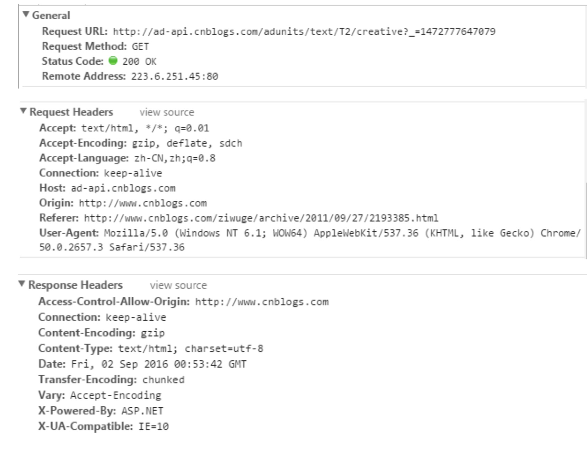

# http相关

## http的无状态

HTTP协议是无状态的，指的是协议对于事务处理没有记忆能力，服务器不知道客户端是什么状态

也就是说，打开一个服务器上的网页和你之前打开这个服务器上的网页之间没有任何联系

注意，**无状态不代表HTTP不能保持TCP连接，更不能代表HTTP使用的是UDP协议（无连接）**

## http的长连接与短连接

首先，看看在tcp/ip层面的定义：

- 长连接：一个tcp/ip连接上可以连续发送多个数据包，
在tcp连接保持期间，如果没有数据包发送，需要双方发检测包以维持此连接，
一般需要自己做在线维持（类似于心跳包）

- 短连接：通信双方有数据交互时，就建立一个tcp连接，数据发送完成后，则断开此tcp连接

在http层面：

- http1.0中，默认使用的是短连接，也就是说，浏览器没进行一次http操作，就建立一次连接，任务结束就中断连接，
譬如每一个静态资源请求时都是一个单独的连接

- http1.1起，默认使用长连接，使用长连接会有这一行`Connection: keep-alive`，譬如，
在长连接的情况下，当一个网页打开完成后，客户端和服务端之间用于传输http的tcp连接不会关闭，
如果客户端再次访问这个服务器的页面，会继续使用这一条已经建立的连接，
keep-alive不会永远保持，它有一个持续时间，一般在服务器中配置（如apache），
另外长连接需要客户端和服务器都支持时才有效

注意，长连接和http2.0的多路复用是不一样的（上述应该可以看出）

## http状态码有那些？分别代表是什么意思？

- 简单版

```js
1xx——指示信息，表示请求已接收，继续处理
2xx——成功，表示请求已被成功接收、理解、接受
3xx——重定向，要完成请求必须进行更进一步的操作
4xx——客户端错误，请求有语法错误或请求无法实现
5xx——服务器端错误，服务器未能实现合法的请求
```

- 进一步

```js
    [
        100  Continue   继续，一般在发送post请求时，已发送了http header之后服务端将返回此信息，表示确认，之后发送具体参数信息
        200  OK         正常返回信息
        201  Created    请求成功并且服务器创建了新的资源
        202  Accepted   服务器已接受请求，但尚未处理
        301  Moved Permanently  请求的网页已永久移动到新位置。
        302 Found       临时性重定向。
        303 See Other   临时性重定向，且总是使用 GET 请求新的 URI。
        304  Not Modified 自从上次请求后，请求的网页未修改过。

        400 Bad Request  服务器无法理解请求的格式，客户端不应当尝试再次使用相同的内容发起请求。
        401 Unauthorized 请求未授权。
        403 Forbidden   禁止访问。
        404 Not Found   找不到如何与 URI 相匹配的资源。

        500 Internal Server Error  最常见的服务器端错误。
        503 Service Unavailable 服务器端暂时无法处理请求（可能是过载或维护）。
    ]
```

- 完整版

```js
    1**(信息类)：表示接收到请求并且继续处理
    100——客户必须继续发出请求
    101——客户要求服务器根据请求转换HTTP协议版本

    2**(响应成功)：表示动作被成功接收、理解和接受
    200——表明该请求被成功地完成，所请求的资源发送回客户端
    201——提示知道新文件的URL
    202——接受和处理、但处理未完成
    203——返回信息不确定或不完整
    204——请求收到，但返回信息为空
    205——服务器完成了请求，用户代理必须复位当前已经浏览过的文件
    206——服务器已经完成了部分用户的GET请求

    3**(重定向类)：为了完成指定的动作，必须接受进一步处理
    300——请求的资源可在多处得到
    301——本网页被永久性转移到另一个URL
    302——请求的网页被转移到一个新的地址，但客户访问仍继续通过原始URL地址，重定向，新的URL会在response中的Location中返回，浏览器将会使用新的URL发出新的Request。
    303——建议客户访问其他URL或访问方式
    304——自从上次请求后，请求的网页未修改过，服务器返回此响应时，不会返回网页内容，代表上次的文档已经被缓存了，还可以继续使用
    305——请求的资源必须从服务器指定的地址得到
    306——前一版本HTTP中使用的代码，现行版本中不再使用
    307——申明请求的资源临时性删除

    4**(客户端错误类)：请求包含错误语法或不能正确执行
    400——客户端请求有语法错误，不能被服务器所理解
    401——请求未经授权，这个状态代码必须和WWW-Authenticate报头域一起使用
    HTTP 401.1 - 未授权：登录失败
    　　HTTP 401.2 - 未授权：服务器配置问题导致登录失败
    　　HTTP 401.3 - ACL 禁止访问资源
    　　HTTP 401.4 - 未授权：授权被筛选器拒绝
    HTTP 401.5 - 未授权：ISAPI 或 CGI 授权失败
    402——保留有效ChargeTo头响应
    403——禁止访问，服务器收到请求，但是拒绝提供服务
    HTTP 403.1 禁止访问：禁止可执行访问
    　　HTTP 403.2 - 禁止访问：禁止读访问
    　　HTTP 403.3 - 禁止访问：禁止写访问
    　　HTTP 403.4 - 禁止访问：要求 SSL
    　　HTTP 403.5 - 禁止访问：要求 SSL 128
    　　HTTP 403.6 - 禁止访问：IP 地址被拒绝
    　　HTTP 403.7 - 禁止访问：要求客户证书
    　　HTTP 403.8 - 禁止访问：禁止站点访问
    　　HTTP 403.9 - 禁止访问：连接的用户过多
    　　HTTP 403.10 - 禁止访问：配置无效
    　　HTTP 403.11 - 禁止访问：密码更改
    　　HTTP 403.12 - 禁止访问：映射器拒绝访问
    　　HTTP 403.13 - 禁止访问：客户证书已被吊销
    　　HTTP 403.15 - 禁止访问：客户访问许可过多
    　　HTTP 403.16 - 禁止访问：客户证书不可信或者无效
    HTTP 403.17 - 禁止访问：客户证书已经到期或者尚未生效
    404——一个404错误表明可连接服务器，但服务器无法取得所请求的网页，请求资源不存在。eg：输入了错误的URL
    405——用户在Request-Line字段定义的方法不允许
    406——根据用户发送的Accept拖，请求资源不可访问
    407——类似401，用户必须首先在代理服务器上得到授权
    408——客户端没有在用户指定的饿时间内完成请求
    409——对当前资源状态，请求不能完成
    410——服务器上不再有此资源且无进一步的参考地址
    411——服务器拒绝用户定义的Content-Length属性请求
    412——一个或多个请求头字段在当前请求中错误
    413——请求的资源大于服务器允许的大小
    414——请求的资源URL长于服务器允许的长度
    415——请求资源不支持请求项目格式
    416——请求中包含Range请求头字段，在当前请求资源范围内没有range指示值，请求也不包含If-Range请求头字段
    417——服务器不满足请求Expect头字段指定的期望值，如果是代理服务器，可能是下一级服务器不能满足请求长。

    5**(服务端错误类)：服务器不能正确执行一个正确的请求
    HTTP 500 - 服务器遇到错误，无法完成请求
    　　HTTP 500.100 - 内部服务器错误 - ASP 错误
    　　HTTP 500-11 服务器关闭
    　　HTTP 500-12 应用程序重新启动
    　　HTTP 500-13 - 服务器太忙
    　　HTTP 500-14 - 应用程序无效
    　　HTTP 500-15 - 不允许请求 global.asa
    　　Error 501 - 未实现
    HTTP 502 - 网关错误
    HTTP 503：由于超载或停机维护，服务器目前无法使用，一段时间后可能恢复正常
```

## http method？

一台服务器要与HTTP1.0兼容，只要为资源实现Get和head方法即可

8中方法

```js
HTTP1.0定义了三种请求方法： GET, POST 和 HEAD方法。
以及几种Additional Request Methods：PUT、DELETE、LINK、UNLINK

HTTP1.1定义了八种请求方法：GET、POST、HEAD、OPTIONS, PUT, DELETE, TRACE 和 CONNECT 方法。
```

`HTTP 1.0`定义参考：[https://tools.ietf.org/html/rfc1945](https://tools.ietf.org/html/rfc1945)

`HTTP 1.1`定义参考：[https://tools.ietf.org/html/rfc2616](https://tools.ietf.org/html/rfc2616)


1.GET是最常用的方法，通常用于请求服务器某个资源

2.HEAD与get类似，但服务器在响应中只返回头部，不返回实体的主体部分

3.put让服务器用请求的主体部分来创建一个由所请求的url命名的新文档，
或者如果那个url已存在的话，用这个主体替代

4.POST起初是用于向服务器输入数据，以前通常用于支持html表单请求，
前后端开发趋势后，通常用于标准的restful请求

5.trace会在目的服务器发起一个迂回诊断，最后一站的服务器会弹回一个trace响应，
并在响应主体中携带它收到的原始请求报文，
trace方法主要用于诊断，验证请求是否如愿的穿过了请求／响应链

6.options方法用于web服务器告知其支持的各种功能。
可以查询服务器支持哪些方法或对某些特殊资源支持哪些方法
跨域ajax复杂请求时候会进行一次options预检，以确认服务端是否支持改次跨域ajax请求
(headers, origin, method)

7.delete请求服务器删除请求url指定的资源

8.CONNECT http/1.0协议中预留给能够将链接改为管道方式的代理服务器

参考RFC，HTTP1.1中标准的方法是只有8种的

## http request报文结构？

rfc2616（HTTP协议）中进行了定义：

1.首行Request-line包括：请求方法，请求url，协议版本，CRLF

2.首行之后是若干行请求头：包括general-header，request-header，或entity-header，每一行以一个CRLF结束

3.请求头和实体消息之间有一个CRLF分隔

4.根据实际请求可能需要包含一个消息实体

示例如下：

```js
GET /Protocols/rfc2616/rfc2616-sec5.html HTTP/1.1
Host: www.w3.org
Connection: keep-alive
Cache-Control: max-age=0
Accept: text/html,application/xhtml+xml,application/xml;q=0.9,image/webp,*/*;q=0.8
User-Agent: Mozilla/5.0 (Windows NT 6.1; WOW64) AppleWebKit/537.36 (KHTML, like Gecko) Chrome/35.0.1916.153 Safari/537.36
Referer: https://www.google.com.hk/
Accept-Encoding: gzip,deflate,sdch
Accept-Language: zh-CN,zh;q=0.8,en;q=0.6
Cookie: authorstyle=yes
If-None-Match: "2cc8-3e3073913b100"
If-Modified-Since: Wed, 01 Sep 2004 13:24:52 GMT

name=qiu&age=25
```

tips:

CRLF->Windows-style
LF->Unix Style
CR->Mac Style

## http response报文结构？

rfc2616中进行了定义：

1.首行是状态行，包括： http版本，状态码，状态描述，后面跟一个CRLF

2.首行之后是若干行响应头，包括：通用头部，响应头部，实体头部

3.响应头部和响应实体之间用一个CRLF分隔

4.最后一个可能是消息实体

示例

```js
HTTP/1.1 200 OK
Date: Tue, 08 Jul 2014 05:28:43 GMT
Server: Apache/2
Last-Modified: Wed, 01 Sep 2004 13:24:52 GMT
ETag: "40d7-3e3073913b100"
Accept-Ranges: bytes
Content-Length: 16599
Cache-Control: max-age=21600
Expires: Tue, 08 Jul 2014 11:28:43 GMT
P3P: policyref="http://www.w3.org/2001/05/P3P/p3p.xml"
Content-Type: text/html; charset=iso-8859-1

{"name": "qiu", "age": 25}
```

### http各个头部的含义

HTTP消息包括客户机向服务器的请求消息和服务器向客户机的响应消息。

这两种类型的消息由:

- 一个起始行

- 一个或者多个头域

- 一个只是头域结束的空行和可选的消息体组成。

HTTP的头域包括:

- 通用头

- 请求头

- 响应头

- 实体头(一般实体头域部分放在响应头中)四个部分。

**每个头域由一个域名，冒号（:）和域值三部分组成**

下图是某次请求的头部信息截图，以及头部中的域名信息的各自含义。



__通用头域__

```js
Request Url: 请求的web服务器地址

Request Method: 请求方式,
Get-向Web服务器请求一个文件，
POST-向WEB服务器发送数据让WEB服务器进行处理，
PUT-向WEB服务器发送数据并存储在WEB服务器内部，
HEAD-检查一个对象是否存在，
DELETE-从WEB服务器上删除一个文件，
CONNECT-对通道提供支持，http/1.0协议中预留给能够将链接改为管道方式的代理服务器
TRACE-跟踪到服务器的路径，
OPTIONS-查询服务器性能(ajax cros方案里面会用这种方式进行预检)

Status Code: 请求的返回状态码，如200代表成功

Remote Address: 请求的远程服务器地址（会转为IP）
```

__请求头域__

```js
Accept: 接收类型，表示浏览器支持的MIME类型
Accept-Ranges：表明服务器是否支持制定范围请求以及哪种类型的分段请求,比如bytes
Accept-Encoding：浏览器支持的压缩类型,如gzip等,超出类型不能接收
Accept-Language：浏览器支持的语言类型，如zh-CN,zh;q=0.8，并且优先支持靠前的语言类型
Cache-Control: 指定请求和响应遵循的缓存机制，如no-cache
Connection: 当浏览器与服务器通信时对于长连接如何进行处理,如keep-alive
Cookie: 当服务器返回cookie，这些cookie是之前服务器发给浏览器的
Host：请求的服务器URL
Origin：最初的请求是从哪里发起的（只会精确到端口）,Origin比Referer更尊重隐私
Referer：该页面的来源URL(适用于所有类型的请求，会精确到详细页面地址)
User-Agent：用户客户端的一些必要信息，如UA头部等
```

__响应头部__

```js
Access-Control-Allow-Origin: 服务器端允许的请求Origin头部
Age: 从原始服务器到代理缓存形成的估算时间(以秒计算,非负)，比如12
Allow:服务器运行的有效的请求行为(如GET,HEAD)，不允许时返回405
Cache-Control：告诉浏览器或其他客户，什么环境可以安全的缓存文档，如private(对于单个用户的整个或部分响应消息，不能被共享缓存处理)
Connection：当浏览器与服务器通信时对于长连接如何进行处理,如keep-alive
Content-Encoding：返回数据在传输过程中所使用的压缩编码方式
Content-Type：返回数据的MIME类型，字符集等
Content-Language：响应体数据的语言
Content-Length：响应体的长度
Content-Location：请求资源可替代的另一个地址,如(/index.html)
Content-Md5：返回资源的MD5校验值
Content-Range：在整个返回体中，本部分的字节位置，如bytes 21010-47021/47022
Date：数据从服务器发送的时间
ETag：请求变量的实体标签的当前值
Expires：应该在什么时候认为文档已经过期,从而不再缓存它
Last-Modified：请求资源的最后修改时间
Location：用来重定向接收方到非请求URL的位置来完成请求或标识新资源,如http:***/*.html
Pragma：包括实现特定的指令，它可应用到响应链上的任何接收方，如no-cache
Refresh：应用于重定向或一个新的资源被创造，在5秒后重定向(网景提出，被大部分浏览器支持)，如5;url=http:***/*/*.html
Retry-After：如果实体暂时不可取，通知客户端在指定时间之后再次尝试
Server：服务器名字，Servlet一般不设置这个值，而是由WEB服务器自己设置
Set-Cookie：设置和页面关联的cookie，web服务器通过传送HTTP包中的Set-Cookie消息把一个cookie发送到用户的浏览器中
Transfer-Encoding：数据传输方式，如chunked(输出的内容长度不能确定，动态页面会用到)
Vary：告诉代理服务器/缓存/CDN，如何判断请求是否一样，值要么是*要么是header中的key名称组合(服务器判断的依据)，
比如Vary中有User-Agent，那么即使相同的请求，但是浏览器不同，CDN也会认为是不同页面。
如果Vary中没有User-Agent，那么CDN/代理会认为是相同的页面，直接给用户返回缓存的页面，而不会再去web服务器请求相应的页面
Via：告知代理客户端响应是通过哪里发送的,如:1.0 fred, 1.1 nowhere.com(Apache/1,1)
X-Powered-By：这个值得意义是告知网站是用何种语言或者框架编写的，
不是由Apache或Nginx输出的，而是由语言解析器或者应用程序框架输出的(如PHP的标准输出值是PHP/5.2.1,
也可在php.ini中增加或修改expose_php=OFF关闭。如.net标准输出为ASP.NET)
Warning：警告实体可能存在的问题
WWW-Authenticate：表明客户端请求实体应该使用的授权方案,如Basic
X-UA-Compatible：页面的UA兼容情况(一般响应页面时asp是会有这个设置)
```

## resuful请求？

- REST -- REpresentational State Transfer（表现层状态转移）

描述的是在网络中一种client和server交互方式
rest本身不实用，实用的是如何设计 RESTful API(REST风格的网络接口)

简述作用：

- URL定位资源，用http动词(GET,POST,DELETE)描述操作

譬如
定义为
GET 用来获取资源
POST 用来新建资源
PUT 用来更新资源
DELETE 用来删除资源

POST http:xxx/friend 添加好友
DELETE http:xxx/friend 删除好友
会禁止使用get请求来删除资源

服务端和客户端之间通过特定形式传递资源
譬如json,xml等

然后http code用来传递server的状态信息
譬如200成功，500内部错误等

总的来说，从以前的jsp,asp,php等架构脱离出来。
变成了前后端分离，前端展示内容，通过API和后台交互

## get和post的区别

- GET在浏览器回退时是无害的，而POST会再次提交请求。

- GET产生的URL地址可以被Bookmark，而POST不可以。

- GET请求会被浏览器主动cache，而POST不会，除非手动设置。

- GET请求只能进行url编码，而POST支持多种编码方式。

- GET请求参数会被完整保留在浏览器历史记录里，而POST中的参数不会被保留。

- GET请求在URL中传送的参数是有长度限制的，而POST没有。

- 对参数的数据类型，GET只接受ASCII字符，而POST没有限制。

- GET比POST更不安全，因为参数直接暴露在URL上，所以不能用来传递敏感信息。

- GET参数通过URL传递，POST放在Request body中。

- GET请求查询更快

除了普通的http请求中列出的区别，实际上它们本质都一样：

- 都是http请求，本质上就是TCP/IP，并无差别。

    - 所以，给GET加上request body，给POST带上url参数，在技术上完全可行
    
    
当然，浏览器层面做了一个限制

- 譬如有加上url参数限制（一般浏览器2K个字节，服务器64K大小），超过的部分不处理

- 还有，Get时，request body偷偷藏了数据，所以虽然GET可以带request body，也不能保证一定能被接收到

当然，在tcp请求层面，它们两者还是有区别的：

- GET产生一个TCP数据包；

- POST产生两个TCP数据包。

对于GET方式的请求，浏览器会把http header和data一并发送出去，服务器响应200（返回数据）；

而对于POST，浏览器先发送header，服务器响应100 continue，浏览器再发送data，服务器响应200 ok（返回数据）。

所以，get速度上来说，会更快